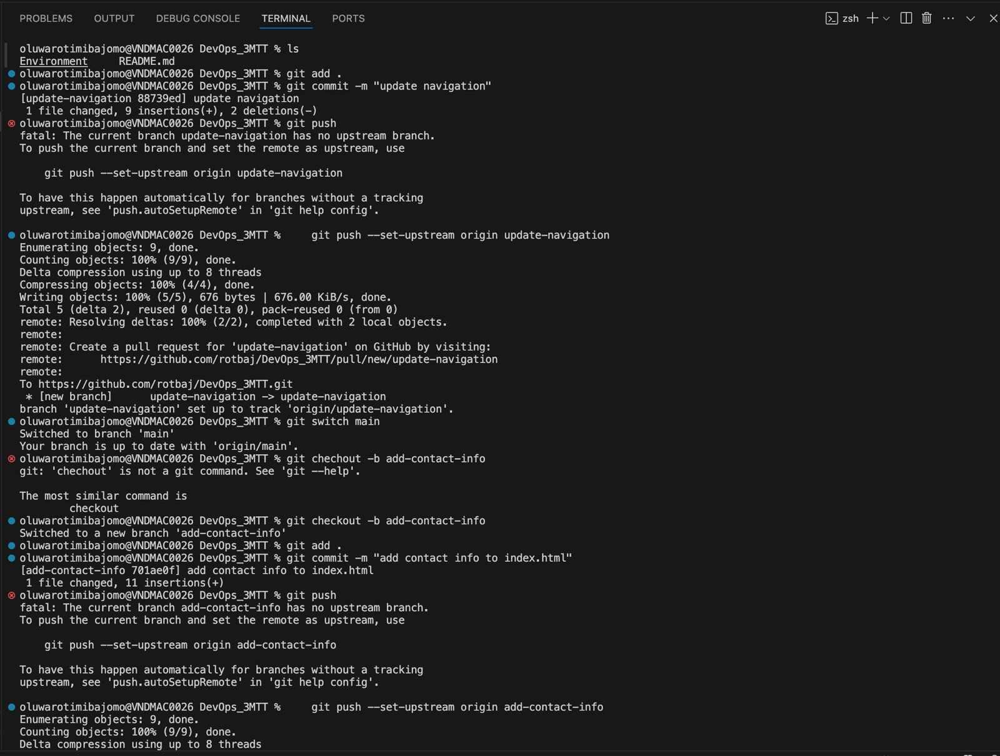
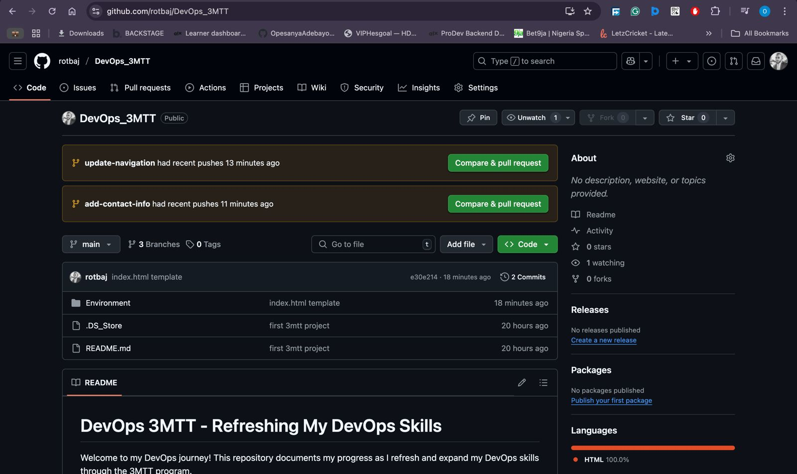

# Git Workflow and Collaboration Project

## Objective

This project focuses on demonstrating proficiency in using Git as a distributed version control system (DVCS) for collaboration and tracking changes.

## Project Description

This project involves the following:

## Screenshots

### Git Commands

### GitHub Repository Dashboard

### index.html urls for 3 branches
https://github.com/rotbaj/DevOps_3MTT/blob/main/Environment/3MTT/index.html
https://github.com/rotbaj/DevOps_3MTT/blob/add-contact-info/Environment/3MTT/index.html
https://github.com/rotbaj/DevOps_3MTT/blob/update-navigation/Environment/3MTT/index.html

