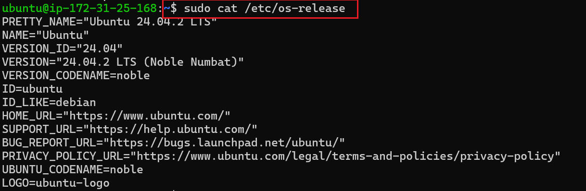

**# Linux commands deep dive**
---

>**this project is about Linux commands and its general syntax**

----
># **Manipulating files and directories on linux**

_we have our client server on our computer. to create a folder with `sudo` commands to manipulate directories and files_

-----
># **verify folder's creation**

_Verify the folder created with `sudo` commands, we can see `example` and `snap`_

># **PWD Commands**

_use `PWD` commands to find the current working directory, `/home/ubuntu` is the path._

**

>#  **Using `sudo` to access the root directory to list the file**
_`sudo ls -i` to list the file inode in the directory_

>#  **Creating Directory**
_Create a directory called `photos` inside `/usr` root directory_

_Navigated into the photos directory. create 3 more directory inside photos directory, navigate into one and show the full path on the screen_

>#  **Using `ls`, `cat`, `cp`, `mv` `rm` commands**

_performing operantion on the commands mentioned above. adding flag to ls(`ls-i`). copy and move file fro one place another. last one is concatenate_

># Touch Commands
_Using `touch`_to create an empty web.html file inside `Document` directory 

>#  **Find Commands**
_Using `find` commands to find file in a specific direvtory_

>**The linux commands manipulation with files**