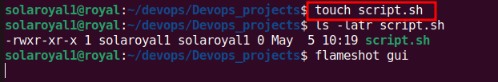
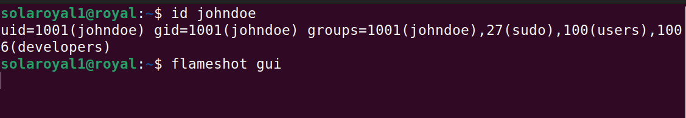

# **Advanced Linux Command**

>**this project is about advanced Linux commands, file permissions and access right, ownership and file management**

----
># **Numeric representation of permission**

- No permission = 0
- Read = 4
- Write = 2
- Execute = 1

>__Permission represented by 7__
1. 4(Read)+2(write)+1(execute) = 7
1. Symbolic: `rwx`
2. meaning: Readc, Write, and execute are all granted

-----
># **Shorthand representation of permission**
_the role of hyphe(`-`) in permission representation

_Using `ls -latr` to show file permiaaion in linux terminal_

># **File permission commands**

_use `chmod` commands allows you to modify the file permissiont_  
_create an empty fil using `touch`_

>#  **update the permission Using `+x` option to add execute permission to the file.**
__the same permission can be execute using numeric options `chmod 755 script.sh`_

_The `775` will add execute permission to `user`, `group`, `others`, while `chmod 777 note.txt` will add all permission `wxr` to note.txt file_

>#  **`Chown` Command**
_I use `Chown` to change ownership of a file from solaroyal1 to peter add it to developer group_

>#  **Superuser priviledges `sudo`, and `exit`commands**

_to change from user to `root user` and `exit` to leave the root user_

># user management on linux
_creating a user with `adduser` command and `/home/johndoe` directory was created. `cd` is used to navigate johdoe root_ 

>#  **Granting administrative priviledge**
_`sudo usermod -aG sudo johndoe` will add johndoe to sudo group._

_id johndoe shows it has not been added to groups_

I log out and log in as new user using `sudo su` to switch to johndoe user. su 

>#  **creating group**
_using `sudo groupadd` developers to add `developers` group also using `sudo groupadd` `devops` to create devops group_

_using `sudo usermod -aG` to add user to a groups_
_using `sudo userdel username` to delete user_

> creating a 5 users [`mary`, `mohammed`, `ravi`, `tunji`, `sofia`]. and crete folder in their /home directory.
____
>All the five user belongs to devops group

>**The advanced linux command done with all necessary fil permission, making it a workdone**