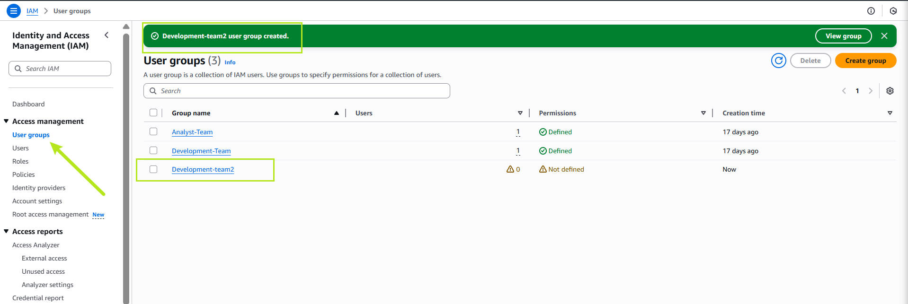

# **AWS Identity and Access management Mini Project**

>**This mini project is about AWS IAM. I will be working on GotoGrowFast.com project using AWS IAM in managing cloud resources security and access management efficiently.**

__Wha is IAM?__
_
The term IAM stands for Identity and Access Management. It refers to the processes, policies, and technologies used to manage digital identities and control user access to resources within an organization or system. IAM ensures that the right individuals have the appropriate access to technology resources for the right reasons. Is like a gatekeeper for your AWS resources, its job is to decide who gets in and what they're allowed to do once they're inside
_

__Wha is IAM User?__
_
IAM user are like individual accounts for different people or entities within our AWS environment. also a user with its own identity. Suppose a company has three developers working on AWS. Instead of giving them the root account credentials, the comapany can make an IAM user for each (e.g., Eric, Jack, and Ade) and only give them access to the resources they need, such as S3 buckets or EC2 instances.
_

__Wha is IAM Role?__
_
An AWS role is an identity within AWS Identity and Access Management (IAM) that has a set of permissions, but unlike an IAM user, it is not associated with a specific person or permanent credentials. An AWS role is a way to delegate access to AWS resources securely and temporarily, without sharing long-term credentials, and is commonly used by services or users who need temporary permissions.
_

__Wha is IAM policy?__
_
An AWS policy is a document that defines permissions for actions on AWS resources. Policies are a fundamental part of AWS Identity and Access Management (IAM), and they determine what actions are allowed or denied for users, groups, and roles.
_

__Example Policy__
_A simple policy to allow reading from a specific S3 bucket might look like this:_

{
  "Version": "2012-10-17",
  "Statement": [
    {
      "Effect": "Allow",
      "Action": "s3:GetObject",
      "Resource": "arn:aws:s3:::my-bucket/*"
    }
  ]
}

__Wha is IAM Group?__
_
An AWS group is a collection of IAM users in AWS Identity and Access Management (IAM). Groups are used to manage permissions for multiple users at once, making it easier to assign and control access in your AWS environment. An AWS group is a way to efficiently manage permissions for multiple IAM users by grouping them together and attaching policies to the group. This makes managing access easier and more scalable.
_

__Wha is MFA?__
_
AWS multi-factor authentication (MFA) is an AWS Identity and Access Management (IAM) best practice that requires a second authentication factor in addition to user name and password sign-in credentials. You can enable MFA at the AWS account level for root and IAM users you have created in your account.
_

# **Part-1**
> ## **Navigate to the AWS management Console**
_Using search bar to navigate to the identity and Access Management (IAM) Services._

_Navigate to left bar and click role, and search EC2 and select "`AmazonEC2FullAcess`" from the list of policies._
_proceed by clicking `Creating policy` to initiate the policy creation process_

>_**Now, Select all EC2 actions**_

>_**Tick `All resources` and click `next`**_

>_**Now click on create policy**_

>_**Policy Created**_

> ## **User Creation**
_Now, proceed to the `users` section and select the option `create user`_

_Enter the desired username for the user. then selec the option of AWS Management console, and if access to the web-based console interface is required._
_Proceed to set up a password for the user_

_Select the attach policy `directly` and navigate to `Filter customer managed policies`, and choose the `policy_for_eric` i creted_

> **_Create user_**

_The user has been created and EC2 has been successfully attached, then click `return to user list`_

# **Part-2**
> ## **On the `user Group` section, enter a name for the group**

>_**Click on "Create user Group**_
_Then proceed to the `user` Section_

> **_This is the group I created._**

>_**Proceeding to the user Section for Jack user creation**_ 
_let create a user named`jack user`. In the `permission` options, select `Add user to the group`, then i choose the group creted named `Development-team2`_

> **_Click next_**

> **_click on create user_**

> **_ Jack user created_**

>_**Same process for Ade as a user too in the same group with jack**_ 

> **_Ade user_**

_Ade created_

>_**Navigate to `policies` section and clik `cretae policy` to begin crafting a new policy**_ 

> **_Choosing EC2 Aand S3 and select full access for them_**

> **_I named the policy `Development-team-policy` and create it_**

>_**Navigate to `User Group` section and click the `Development-team-policy` group**_ 

_Proceed to the `permissions` section and add the neccesary permissions_

> **_Click on `Attach policy`_**

_Policy is now attached to the group, granting full permission to EC2 for the group's users._

**This is all concerning The AWS Identity and Access management Mini Project**
