# 📦 Working with Docker Containers

This mini-project covers container basics: how to run, manage, and remove containers using the Ubuntu image. It builds on what we did previously with Docker images.

---

## 🔹 Introduction to Docker Containers

Docker containers are lightweight, executable units that package your application and its dependencies. They can be started, stopped, modified, and removed as needed.

---

## 1️⃣ Running a Container

Create a container using the Ubuntu image:

```bash
docker run -it ubuntu
```

> 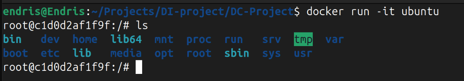

This launches a container interactively (`-it`). Type exist to go back to terminal

---

## 2️⃣ Container Created but Not Running

Check all containers, including stopped ones:

```bash
docker ps -a
```

> 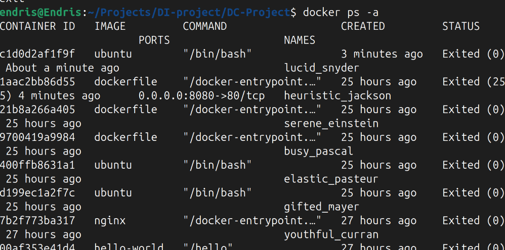

---

## 3️⃣ Starting the Container

```bash
docker start -ai <container_id>
```

> 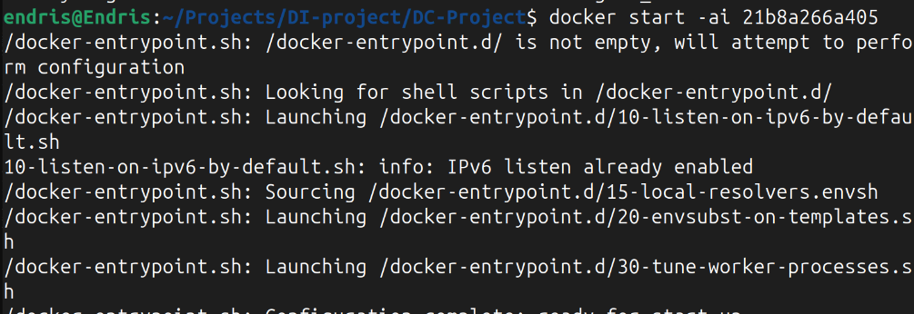

This starts the stopped container and attaches to it.

---

## 4️⃣ Launching with Environment Variables

```bash
docker run -e MY_VAR=hello -it ubuntu env
```

> 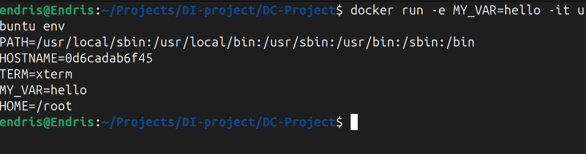

This sets and displays an environment variable inside the container.

---

## 5️⃣ Running in the Background (Detached Mode)

```bash
docker run -d ubuntu sleep 60
```

> 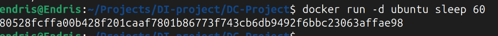

This runs a background container that sleeps for 60 seconds.

---

## 6️⃣ Container Lifecycle

### Start a Stopped Container

```bash
docker start <container_id>
```

> 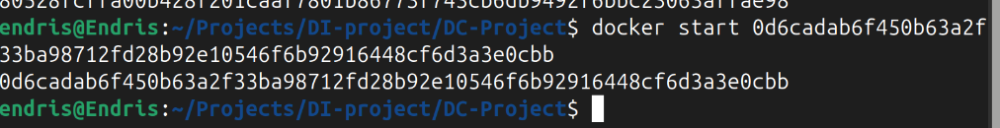

### Stop a Running Container

```bash
docker stop <container_id>
```

> 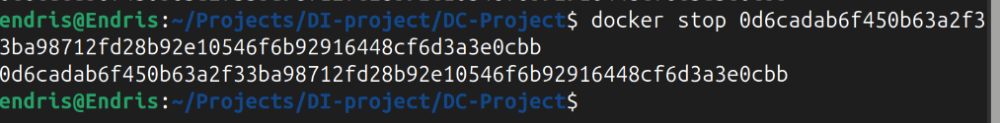

### Restart a Container

```bash
docker restart <container_id>
```

> 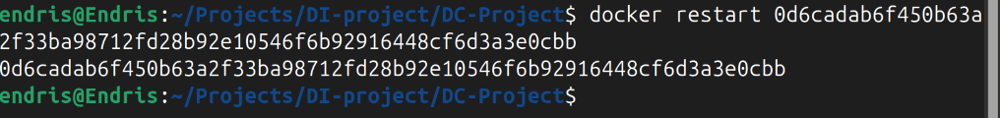

---

## 7️⃣ Removing Containers

```bash
docker rm <container_id>
```

> 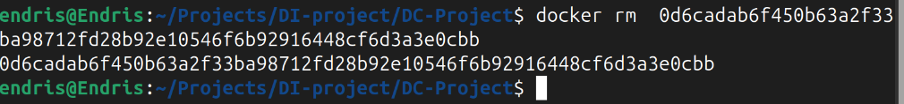

This deletes the container only—not the image.

---

## ✅ Side Hustle Task: Docker Container Operations

1. Start a container and run a simple command:

```bash
docker run -it ubuntu echo "Hello from container"
```

> 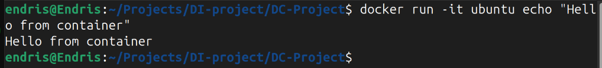

2. Stop the container and verify its status:

```bash
docker ps -a
```

> 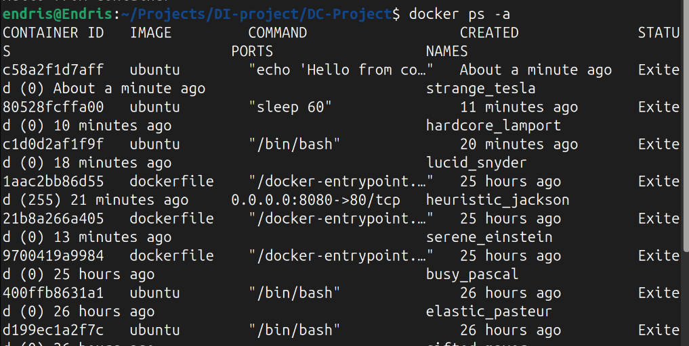

3. Restart the container:

```bash
docker restart <container_id>
```

> 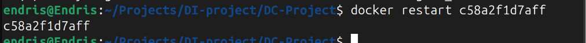

4. Remove the container:

```bash
docker rm <container_id>
```

> 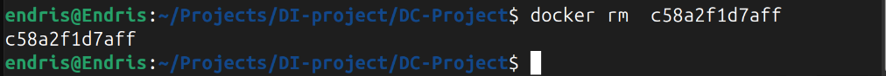

---

## 📝 Summary

* You ran containers in both interactive and background modes.
* You passed environment variables and controlled the lifecycle (start, stop, restart).
* You removed containers cleanly after use.
