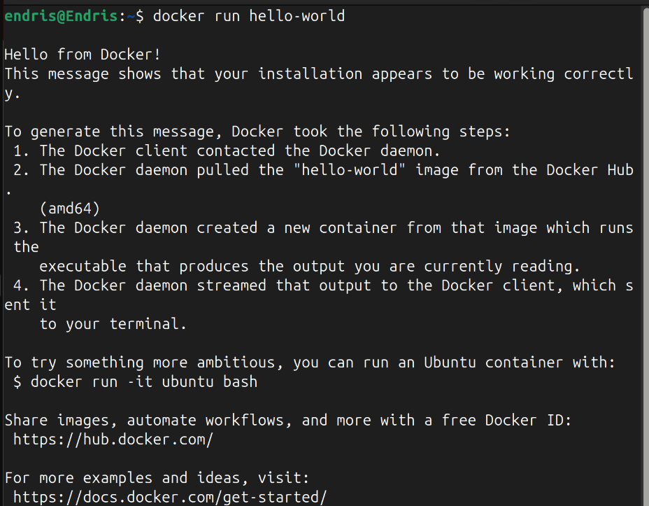

# 🚀 Docker Basics Project

A beginner-friendly guide to installing Docker on Ubuntu 20.04, running your first container, and mastering essential Docker commands.

---

## 📑 Table of Contents

- [Project Overview](#-project-overview)
- [Installing Docker on Ubuntu 20.04](#-installing-docker-on-ubuntu-2004)
- [Verify Installation with Hello World](#-verify-installation-with-hello-world)
- [Basic Docker Commands](#-basic-docker-commands)
- [Summary](#-summary)

---

## 🔹 Project Overview

This project introduces Docker and shows how to install it on Ubuntu 20.04, run your first container, and execute basic Docker commands.

---

## ⚙️ Installing Docker on Ubuntu 20.04

### 1. Add Docker’s GPG Key

```bash
sudo install -m 0755 -d /etc/apt/keyrings
curl -fsSL https://download.docker.com/linux/ubuntu/gpg \
  | sudo gpg --dearmor -o /etc/apt/keyrings/docker.gpg
sudo chmod a+r /etc/apt/keyrings/docker.gpg
```

> 

### 2. Add Docker Repository

```bash
echo \
  "deb [arch=$(dpkg --print-architecture) signed-by=/etc/apt/keyrings/docker.gpg] \
  https://download.docker.com/linux/ubuntu $(lsb_release -cs) stable" \
  | sudo tee /etc/apt/sources.list.d/docker.list > /dev/null
```

> 

### 3. Install Docker Engine

```bash
sudo apt update
sudo apt install docker-ce docker-ce-cli containerd.io docker-buildx-plugin docker-compose-plugin
```

> 

### 4. Run Docker Without Sudo (Optional)

Add your user to the `docker` group to run Docker commands without `sudo`:

```bash
sudo usermod -aG docker $USER
```

> **Note:** You may need to log out and log back in for this to take effect.

> 

---

## ✅ Verify Installation with Hello World

Test your Docker installation by running the Hello World container:

```bash
docker run hello-world
```

> 

---

## 🔧 Basic Docker Commands

### 1. Run a Container

```bash
docker run nginx
```


### 2. View Running Containers

```bash
docker ps
```


### 3. View All Containers (including stopped)

```bash
docker ps -a
```


### 4. Stop a Container

```bash
docker stop <container_id>
```

> Replace `<container_id>` with the actual ID from `docker ps`.


### 5. Pull an Image

```bash
docker pull nginx
```


### 6. Push an Image

```bash
docker push <your-username>/<image-name>
```

> Replace `<your-username>` and `<image-name>` with your Docker Hub username and image name.


### 7. List Images

```bash
docker images
```


### 8. Remove an Image

```bash
docker rmi <image_id>
```

> Replace `<image_id>` with the actual image ID from `docker images`.

> 

---

## 📝 Summary

This project covers:

- Installing Docker on Ubuntu 20.04
- Running your first container
- Executing core Docker commands

---

Happy Dockering! 🐳

