# 📦 Docker Images: Quick Start Guide

A simple guide to pulling images, building your own Docker image, running containers, exposing ports, and pushing to Docker Hub. Screenshots are in the `img` folder.

---

## 📑 Table of Contents
- [Introduction](#introduction)
- [Pull Images from Docker Hub](#pull-images-from-docker-hub)
- [Run a Container](#run-a-container)
- [Create a Dockerfile](#create-a-dockerfile)
- [Build Your Image](#build-your-image)
- [Run Your Custom Container](#run-your-custom-container)
- [Open Port 8080](#open-port-8080)
- [View Containers](#view-containers)
- [Push to Docker Hub](#push-to-docker-hub)
- [Summary](#summary)

---

## Introduction
Docker images are packages with everything needed to run an app: code, libraries, and tools. You create them with a `Dockerfile` and run them as containers.

---

## Pull Images from Docker Hub

Search for and pull an image:

```bash
docker search ubuntu
```
> 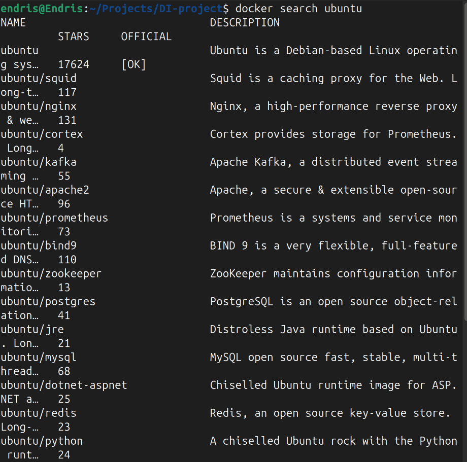

```bash
docker pull ubuntu
```
> 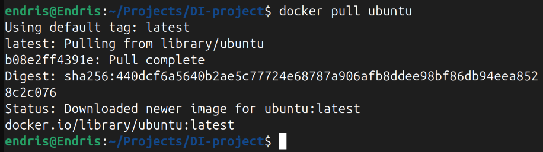

List downloaded images:

```bash
docker images
```
> 

---

## Run a Container

Start a container with an interactive shell:

```bash
docker run -it ubuntu
```
> 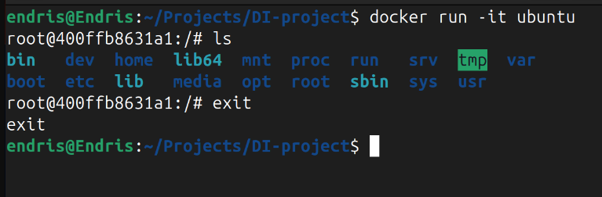

Type `exit` to leave the container.

---

## Create a Dockerfile

A Dockerfile is a script to build your image. Example:

```Dockerfile
FROM nginx:latest
WORKDIR /usr/share/nginx/html/
COPY index.html /usr/share/nginx/html/
EXPOSE 80
```

- `FROM`: base image
- `WORKDIR`: working directory
- `COPY`: copy files
- `EXPOSE`: open port

Create both files:

```bash
nano Dockerfile
nano index.html
```
> 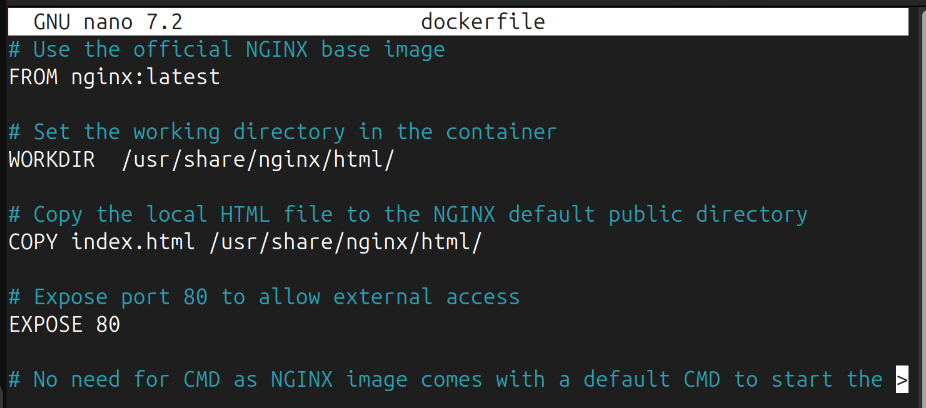
> 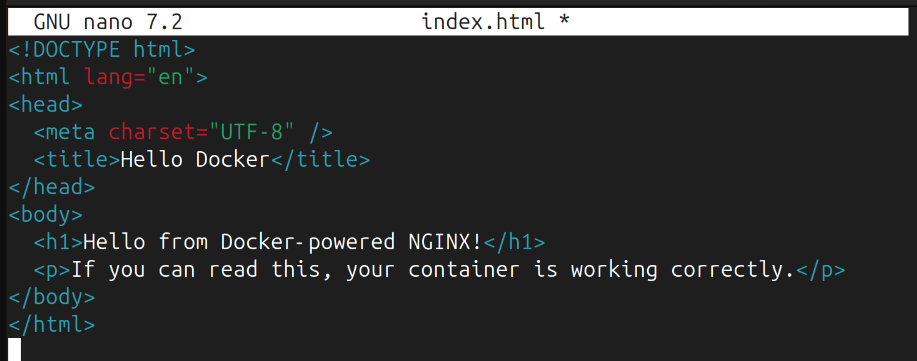

---

## Build Your Image

Build your custom image (named `dockerfile`):

```bash
docker build -t dockerfile .
```
> 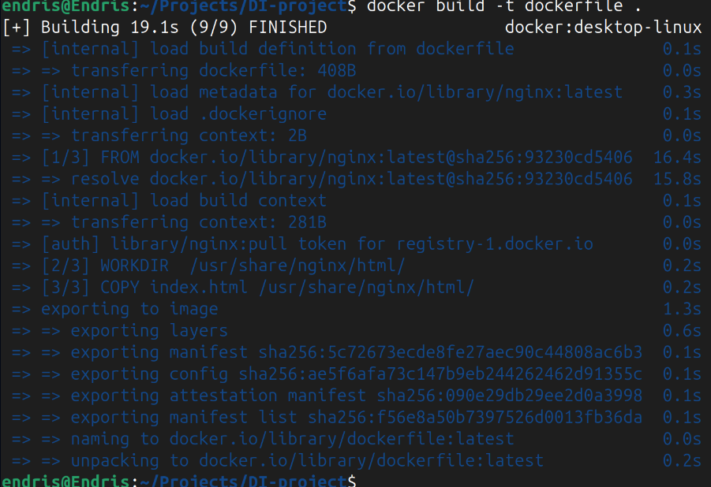

---

## Run Your Custom Container

Expose it on port 8080:

```bash
docker run -p 8080:80 dockerfile
```
> 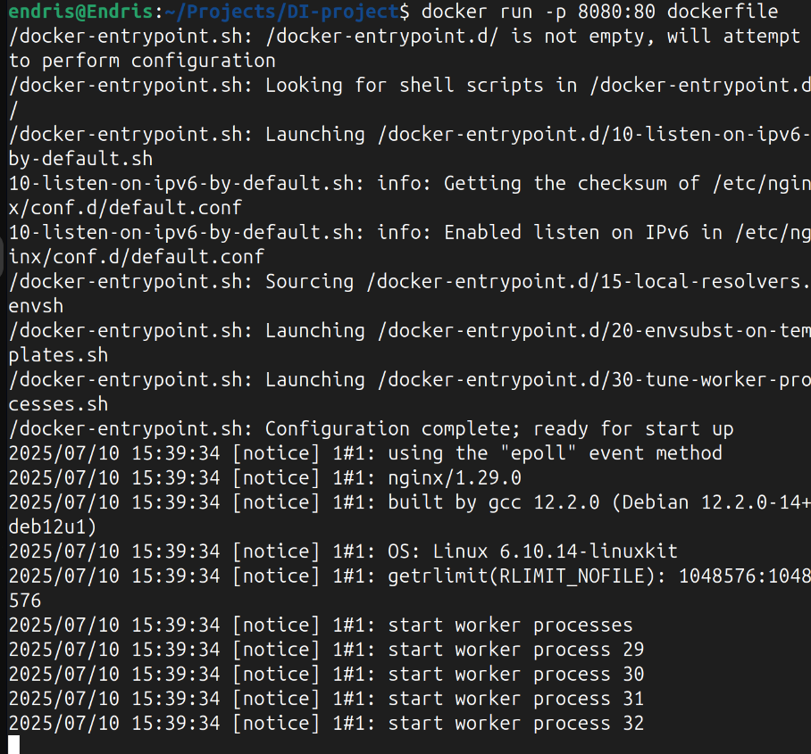

Open in your browser:  
`http://<your-public-ip>:8080`
> 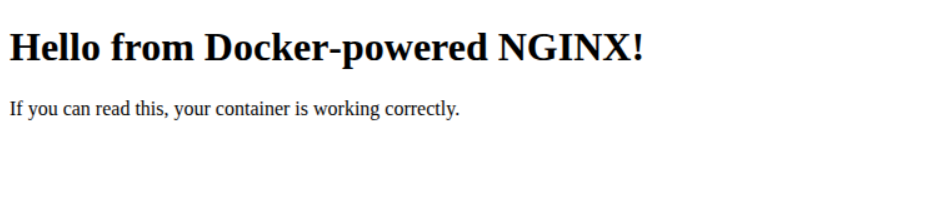

---

## Open Port 8080

If using AWS EC2, add a security group rule:
- Type: `Custom TCP`
- Port: `8080`
- Source: `Anywhere (0.0.0.0/0)`

> 

---

## View Containers

List all containers:

```bash
docker ps -a
```
> 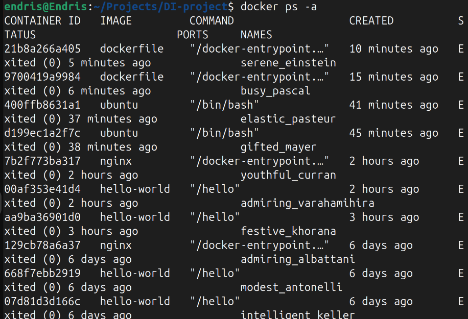

Start a stopped container:

```bash
docker start dockerfile
```
> 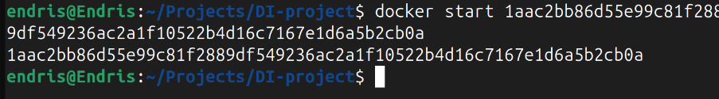

---

## Push to Docker Hub

1. Create a [Docker Hub](https://hub.docker.com) account and repository.
   > 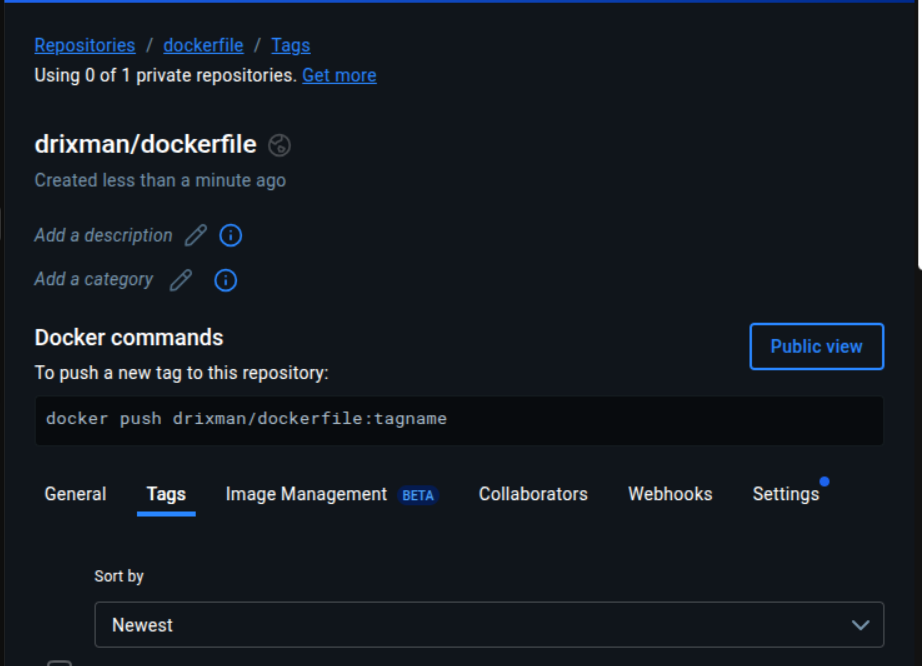
2. Tag your image:
   ```bash
   docker tag dockerfile yourdockerhubusername/mynginx:1.0
   ```
   > 
3. Login:
   ```bash
   docker login
   ```
   > 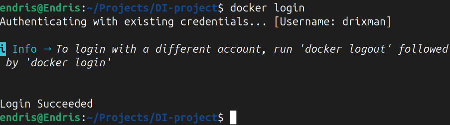
4. Push:
   ```bash
   docker push yourdockerhubusername/mynginx:1.0
   ```
   > 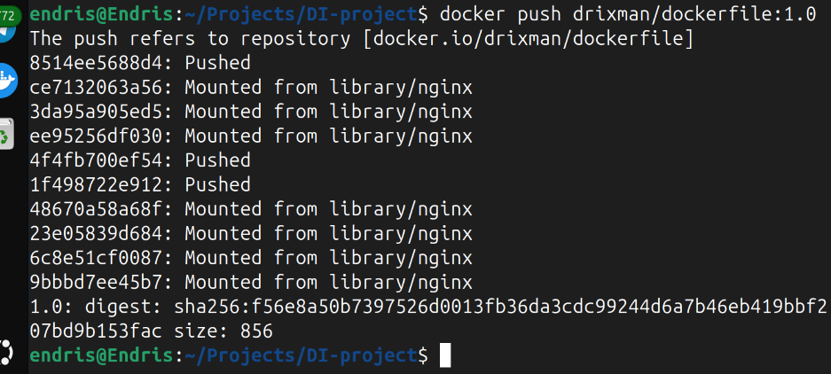
5. Confirm on Docker Hub:
   > 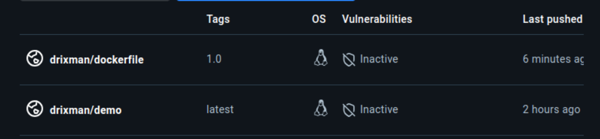

---

## Summary

- Pulled and searched Docker images
- Built a Dockerfile using NGINX
- Ran and exposed a container on port 8080
- Opened port 8080 for external access
- Tagged and pushed the image to Docker Hub

---

Happy Dockering! 🐳


