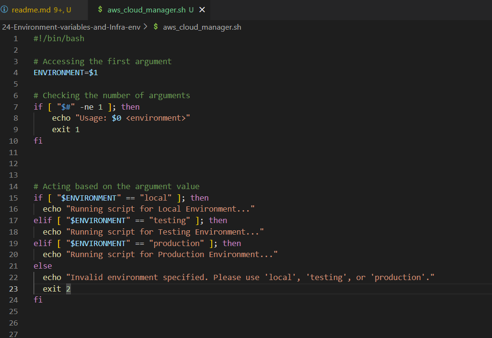

# Understanding Environment Variables & Infrastructure Environments: Key Differences

As learning continues into the world of technology and its building blocks, two essential concepts often come to the forefront: "Infrastructure Environments" and "Environment Variables". Despite both terms featuring "Environment", they play distinct roles in the realm of scripting and software development. This common terminology can lead to confusion, making it crucial to distinguish and understand each concept from the outset.

## Infrastructure Environments

Infrastructure environments refer to the various stettings where software applications are developed, tested and deployed, each serving a unique purpose in the software lifecycle.

For example, working with a development team building a FinTech product. Below are the various environments:

    - VirtualBox + Ubuntu: The development environment where all local development is done on the laptop.

    - AWS Account 1: The testing environment where, after local development is completed, the code is pushed to an EC2 instance for further testing.

    - AWS Account 2: The production environment, where after tests are completed in Account 1, the code is pushed to an EC2 instance in AWS Account 2, where the customers consume the Fintech product through a website.

Each setup is considered as an Infrastructure Environment.

## Environment Variables

Environment variables are key-value pairs used in scripts or computer code to manage configuration values and control software behaviour dynamically.

Using the FinTech example above, the product development team needs to connect to a database to fetch financial data. However, the details of this database connection like database URL, username, and password differ between the three infrastructure environments(development, testing, and production).

To develop a shell script that will be reused across all the 3 environments, then, it is important to dynamically fetch the correct value for connectivity to those environments.

Here is how environment variables come into play:

1. Development Environment (VirtualBox + Ubuntu):

Environment Variables:
    - BD_URL=localhost
    - DB_USER=test_user
    - DB_PASS=test_pass

The environment variables point to a local database on the system(laptop) wher one can safely experiment without affecting real or test data.

2.Testing Environment(AWS Account 1):

Environment Variables:
    - DB_URL=testing-db.example.com
    - DB_USER=testing_user
    - DB_PASS=testing_pass

In this environment, the variables are configured to connect to a remote database dedicated to testing. This ensures that tests are performed in s controlled environment that simulates production settings without risking actual customer data.

3.Production Environment(AWS Account 2):

Environment Variables:

    - DB_URL=production-db.example.com
    - DB_USER=prod_user
    - DB_PASS=prod_pass

Finally, when the application is running in the production environment, the environment variables switch to ensure the application connects to the live database. This is where real customer interactions happens and the data needs to be accurate and secure.

## DEMO

Development of shell script to manage cloud infrastructure.

Tasks:

 Create aws_cloud_manager.sh script

Execute `sudo chmod +x aws_cloud_manager.sh` command to have execution permission

Running the code as it is gives the output below because there is no $ENVIRONMENT variable set yet.

Setting the environment variable by executing `export ENVIRONMENT=production` in the terminal and runnig the script again gives this output

The export command is used to set key and values for environment variables.

Environment variables can aso be set directly within the script.

Running this version of the script would mean everytime it is run, it will consider the logic for testing environment only because the value has been "hard coded" in the script and that is no longer dynamic. The best way would be to use the command line arguments.

Aiming for flexibility by allowing scripts to accept input dynamically. This is where positional parameters come into place. It's a capability in shell scripting that enables passing arguments to scripts at runtime, and replaces the argument with the parameter inside the script.

- The argument passed to the scripts is the value that is provided at runtime.

- In the case belo where the argument is "testing", and it is also the value to the variable witin the script.

`./aws_cloud_manager.sh testing`

- Inside the script, the Environment variable is refactor to this

`ENVIRONMENT=$1`

'$1' is the positional parameter which will be replaced by the argument passed to the script.
Becuase it is possible to pass multiple parameters to a script, dollar sign '$' is used to prefix the position of the argument passed to the script. If another variable within the script is called NUMBER_OFINSTANCES that determines how many EC2 instances get provisioned, the call the script will look like this

`./aws-cloud_manager.sh testing 5`

The positional parameters inside the script will look like this

`ENVIRONMENT=$1`
`NUMBER_OF_INSTANCES=$2`

Each positional parameter within the script corresponds to a specific argument passed to the script and each parameter has a position represented by an index number.

### Condition to check the number of arguments

Creating shell scripts to meet specific requirements is one aspect of development, but ensuring their cleanliness and freedom from bugs is equally crucial. Integrating logical checks periodically to validate data is considerd a best practice in script development.

 A good example of this is verifying the number of arguments passed to the script being developed, ensuring that it receives the correct input required for its execution, and providing clear guidance to users in case of incorrect usage.

 Below is a code snippet that ensures that when the script is executed, exactly 1 argument is passed to it, otherwise it fails with an exit code 1 and shows amessge telling the user how to use the script

`# Checking the number of arguments`
`if [ "$#" -ne 0 ]; then`
    `echo "Usage: $0 <environment>"`
    `exit 1`
`fi`

'$#' is a special variable that holds the number of arguments passed to the script.

'-ne' means "Not equal"

'$0' represent the positional parameter of 0, which is the script itself.

The updated script looks like this

### AWS Simulation

Below is the screenshot of the source code used for powering the automation

1. Functions: Implemented custom functions to modularize the tasks of creating EC2 instance and S3 bucket.

EC2-running

S3 bucket create success

2. Array: Used array to manage the list of ec2 instances and s3 buckets

3. Environment Variables: Leveraged environment variables to store configuration variables

4. Command Line Arguments: Accepted command line arguments to customize script behaviour

5. Error handling: Implemented robust error handling mechanisms to catch and respond to AWS service exceptions.

