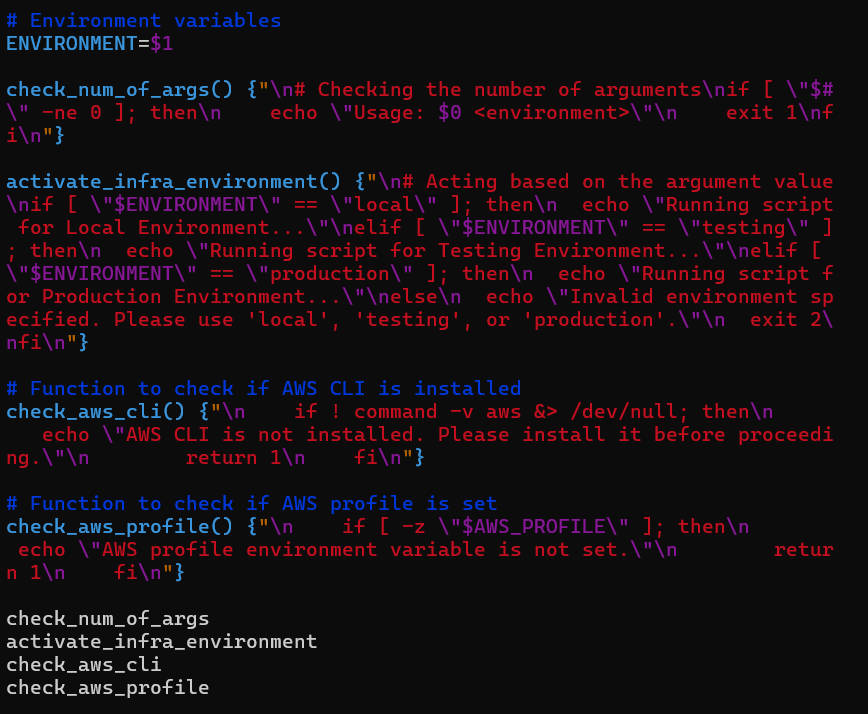

# **Working with functions**

>**The goal is develop a shell script for one of DataWise Solutions's clients that automate the setup of Ec2 instance s3 bucket. the critical part is functions**

_Functions: organizing your code is key to maintainig clarity and efficiency. one of the way to cheive is function_

_By encapsulating specific logic within functions, you can streamline your nscript and improve it._

lets consider the following logic and encapsulate them in functions

1. Check if script has an argument
1. check if AWS CLi is installed
1. check if environment variale exist to authenticate to AWS

> **create function**

 
_it would look like this with a function called check_num_of_args._

_when a function is called in a shell script, it remains inactive until it is invoked or called within the script. To execute the code withtin the function, you must place c callto the function in a relevant part of your script_

_with  refactored version of the code, we now have th flow like this;_

1. Environment variable moved to the top
2. Function defined
3. Function call
4. Activate based on infrastructure environment section.

_encapsulate number 4 in a function and call all the functions at the emd of the script_ 

**Check if AWS CLI is installed** 

**Check if environment variable exist to authenticate to AWS** 
_The ~/.aws/credentials and ~/.aws/configure files are commonly used to store AWS credebtials and configuration settings, respectively._
running the asw configure, you can use the `cat` command to open the file inside.

**Credential file(~/.aws/credentials)**

**Config file(~/.aws/config)**

a profile will enable you to easily switch between different AWS configuration

**AWS Profile**
The aws_profile environment variable allows users to specify which profile to use from aws config.

**_our shell script wil now look like this_**

**This is all concerning working with functions in shell script**
