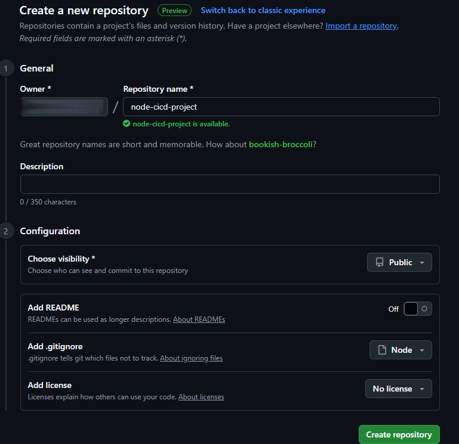

# CI/CD with GitHub Actions: Project Documentation

This README documents the process of setting up a simple Node.js web application and implementing Continuous Integration and Continuous Deployment (CI/CD) using GitHub Actions. The project demonstrates how to automate testing and ensure code quality across multiple Node.js versions.

## Project Overview

The goal of this project was to create a basic Node.js application that serves a static web page and to set up a CI/CD pipeline using GitHub Actions. The pipeline automates testing across multiple Node.js versions and ensures the application is built and deployed consistently.

### Prerequisites

To complete this project, the following were required:
- **Git and GitHub**: Basic knowledge of version control and GitHub repository management.
- **Node.js and npm**: Familiarity with Node.js for building the application and npm for package management.
- **Text Editor/IDE**: Used Visual Studio Code for editing code.
- **Local Development Environment**: Node.js installed locally to run and test the application.
- **Internet Connection**: Required for pushing to GitHub and accessing GitHub Actions.
- **Basic CI/CD Understanding**: Helpful but not mandatory, as the course provided foundational knowledge.

## Step-by-Step Implementation

### 1. Setting Up the GitHub Repository

1. **Created a GitHub Repository**:
   - Navigated to GitHub and created a new repository named `node-cicd-project`.
   - Initialized it with a README and a `.gitignore` file for Node.js.
   - Cloned the repository locally using:
     ```bash
     git clone https://github.com/your-username/node-cicd-project.git
     ```

   **screenshots**:
   


### 2. Creating the Node.js Application

1. **Initialized the Node.js Project**:
   - Navigated to the cloned repository folder:
     ```bash
     cd node-cicd-project
     npm init -y
     ```
   - Installed Express.js for serving the static web page:
     ```bash
     npm install express
     ```

2. **Created the Application Code**:
   - Created an `index.js` file to set up a basic Express server:
     ```javascript
     const express = require('express');
     const app = express();
     const port = 3000;

     app.get('/', (req, res) => {
       res.send('<h1>Welcome to My CI/CD Demo</h1><p>This is a simple static page served by Express.</p>');
     });

     app.listen(port, () => {
       console.log(`Server running at http://localhost:${port}`);
     });
     ```
   - Created a simple test script `test.js` using Mocha for testing:
     ```javascript
     const assert = require('assert');
     describe('Basic Test', () => {
       it('should return true', () => {
         assert.equal(true, true);
       });
     });
     ```
   - Installed Mocha for testing:
     ```bash
     npm install mocha --save-dev
     ```
   - Added a test script to `package.json`:
     ```json
     "scripts": {
       "start": "node index.js",
       "test": "mocha"
     }
     ```

3. **Tested Locally**:
   - Ran the application locally:
     ```bash
     npm start
     ```
   - Opened `http://localhost:3000` in a browser to verify the static page.
   - Ran tests:
     ```bash
     npm test
     ```

   **Screenshots**:
> 
> .

### 3. Setting Up GitHub Actions Workflow

1. **Created the Workflow File**:
   - Created a `.github/workflows/ci.yml` file in the repository with the following content:
     ```yaml
     name: CI Pipeline
     on:
       push:
         branches: [ main ]
       pull_request:
         branches: [ main ]
     jobs:
       build:
         runs-on: ubuntu-latest
         strategy:
           matrix:
             node-version: [14.x, 16.x, 18.x]
         steps:
         - uses: actions/checkout@v3
         - name: Use Node.js ${{ matrix.node-version }}
           uses: actions/setup-node@v3
           with:
             node-version: ${{ matrix.node-version }}
         - name: Install Dependencies
           run: npm install
         - name: Run Tests
           run: npm test
     ```
   - This workflow triggers on `push` or `pull_request` events to the `main` branch, tests the application across Node.js versions 14.x, 16.x, and 18.x, and runs the test suite.

   **screenshots**:
   > 

2. **Pushed Changes to GitHub**:
   - Committed and pushed the code to the `main` branch:
     ```bash
     git add .
     git commit -m "Initial commit with Node.js app and GitHub Actions workflow"
     git push origin main
     ```

   **screenshots**:
   > 
  
### 4. Setting Up Deployment Workflow

1. **Configured Heroku**:
   - Created a Heroku app and added the API key and app name to GitHub Secrets (`HEROKU_API_KEY` and `HEROKU_APP_NAME`).
   - Created a `Procfile` (see `Procfile` artifact).
   - Created `.github/workflows/deploy.yml` (see `deploy.yml` artifact) to deploy to Heroku on pushes to `main`.

2. **Pushed Deployment Changes**:
   - Committed and pushed:
     ```bash
     git add .github/workflows/deploy.yml Procfile
     git commit -m "Add Heroku deployment workflow and Procfile"
     git push origin main
     ```

   **Evidence**:
   - Screenshot of the Heroku dashboard or GitHub Actions deploy workflow run saved as `img/heroku-deploy-success.png`.

### 5. Experimenting and Learning

1. **Modified Workflows**:
   - Added a failing test to `test.js` to observe CI failure:
     ```bash
     git add test.js
     git commit -m "Add failing test to experiment with CI"
     git push origin main
     ```
   - Updated `ci.yml` to include Node.js 20.x in the matrix:
     ```bash
     git add .github/workflows/ci.yml
     git commit -m "Add Node.js 20.x to CI matrix"
     git push origin main
     ```

2. **Added Different Test Types**:
   - Updated `test.js` to include additional unit tests (see `test.js` artifact).
   - Ran tests locally and pushed changes:
     ```bash
     npm test
     git add test.js
     git commit -m "Add additional unit test"
     git push origin main
     ```

   **Evidence**:
   - Screenshot of the failed CI workflow run saved as `img/ci-workflow-failure.png`.
   - Screenshot of the updated CI workflow with Node.js 20.x saved as `img/ci-matrix-updated.png`.
   - Screenshot of updated test results saved as `img/test-results-additional.png`.

## Project Structure

```
node-cicd-project/
├── .github/
│   └── workflows/
│       ├── ci.yml
│       └── deploy.yml
├── img/
│   ├── repository-creation.png
│   ├── local-app-running.png
│   ├── test-results.png
│   ├── test-results-updated.png
│   ├── ci-workflow-updated.png
│   ├── ci-workflow-failure.png
│   ├── ci-matrix-updated.png
│   ├── heroku-deploy-success.png
│   ├── test-results-additional.png
├── index.js
├── test.js
├── package.json
├── Procfile
├── node_modules/
└── README.md
```

## Lessons Learned

- **Enhanced Testing**: Added unit and integration tests using Mocha, Chai, and Supertest to ensure code reliability.
- **CI/CD Automation**: Updated the CI workflow to include linting and tested across multiple Node.js versions.
- **Deployment**: Successfully deployed the app to Heroku using a dedicated GitHub Actions workflow.
- **Experimentation**: Learned how workflow changes (e.g., failing tests, new Node.js versions) affect the CI/CD process.

## Next Steps

- Add more complex tests (e.g., testing additional endpoints or edge cases).
- Explore other deployment platforms like AWS or Vercel.
- Implement caching in GitHub Actions to speed up workflows.

## Evidence Screenshots

All screenshots are stored in the `img/` folder:
- `repository-creation.png`: GitHub repository creation.
- `local-app-running.png`: Application running locally in the browser.
- `test-results.png`: Initial test results.
- `test-results-updated.png`: Updated test results with unit and integration tests.
- `ci-workflow-updated.png`: CI workflow with linting and tests.
- `ci-workflow-failure.png`: CI workflow failure from experiment.
- `ci-matrix-updated.png`: CI workflow with updated Node.js versions.
- `heroku-deploy-success.png`: Heroku deployment success.
- `test-results-additional.png`: Additional test results.