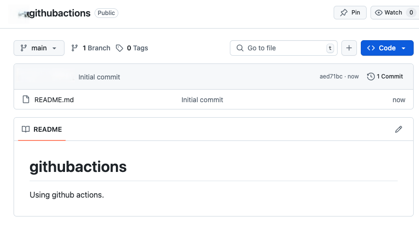
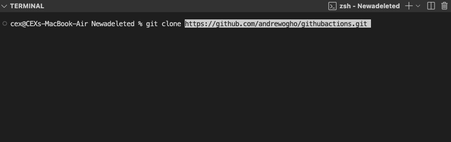
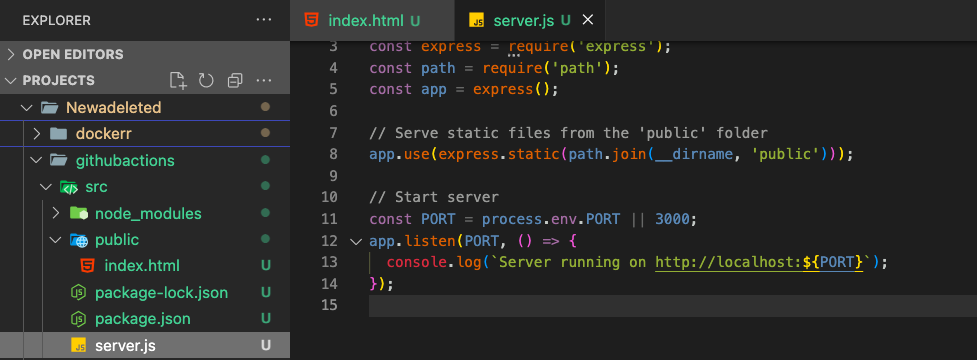
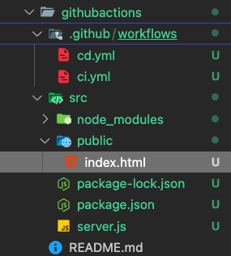
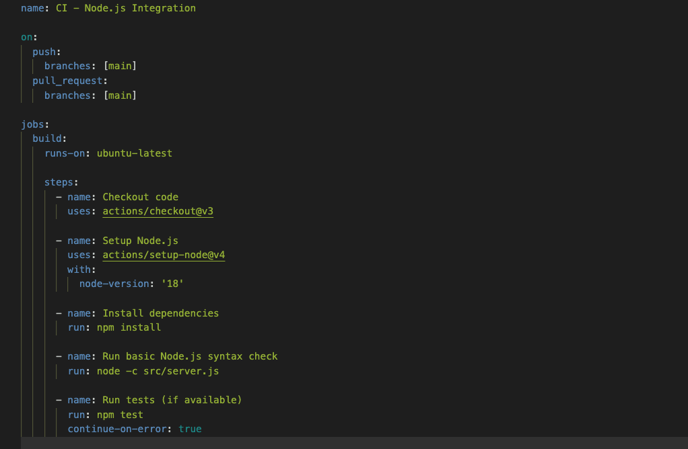
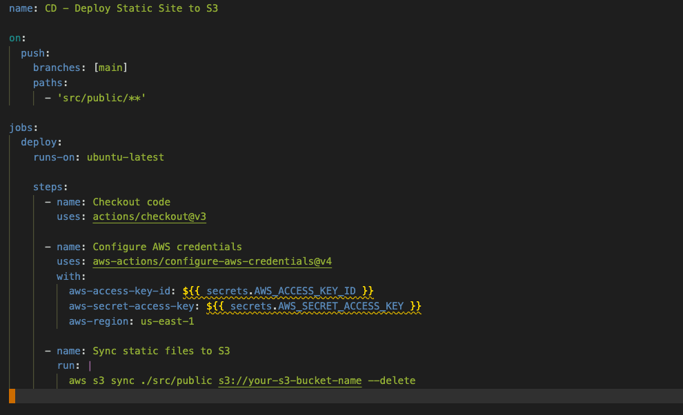
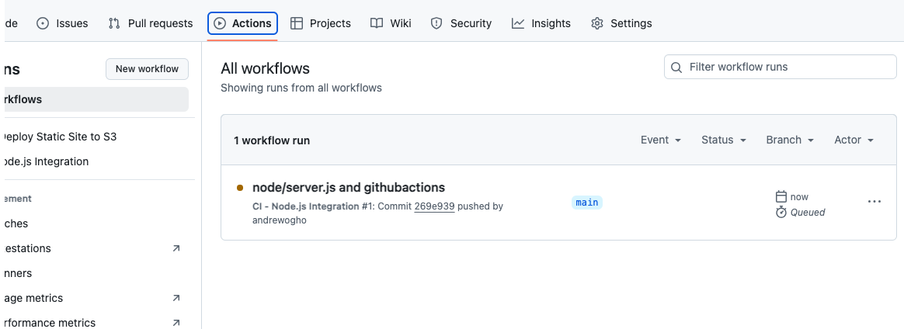
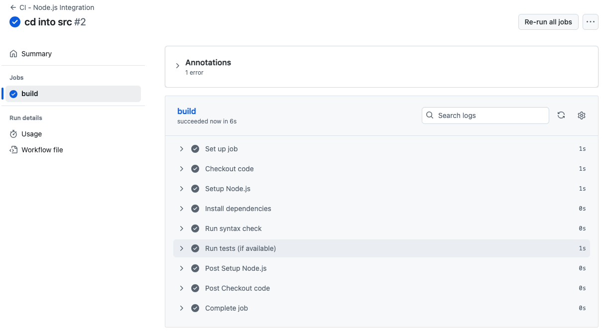

# githubactions
Using github actions.

## Intro to Github Actions

### Project 1:

1. Init a Github repo.
Create a new repo on github `githubactions`
Clone it to local machine

2. Create a simple node.js app.
Initial a node.js app
Create a simple server using `express.js` to serve the static web page
Add code to repo and push to github

4. Write first github actions workflow.

Workflow was split into two parts: `ci.yml` & `cd.yml` for improved organisation and code quality.

5. Learn more.

Further advanced configurations will be done as we progress deeper into using git actions.