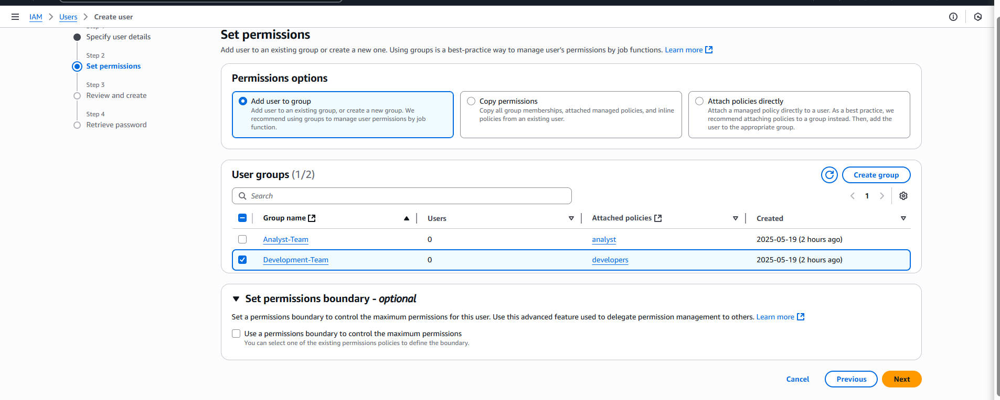
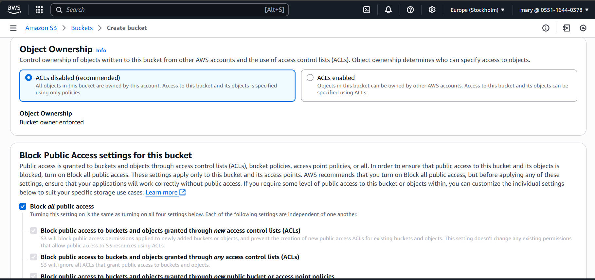
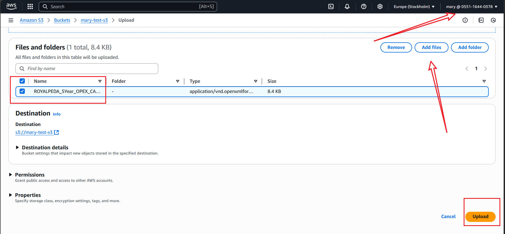
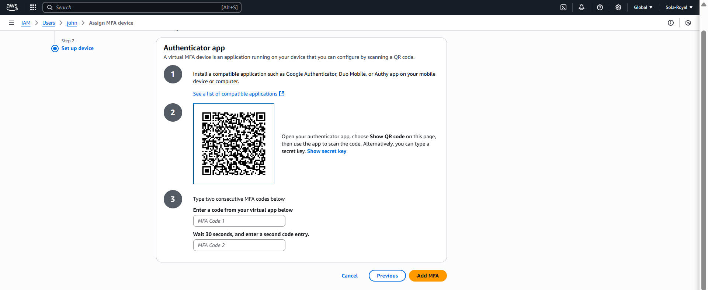
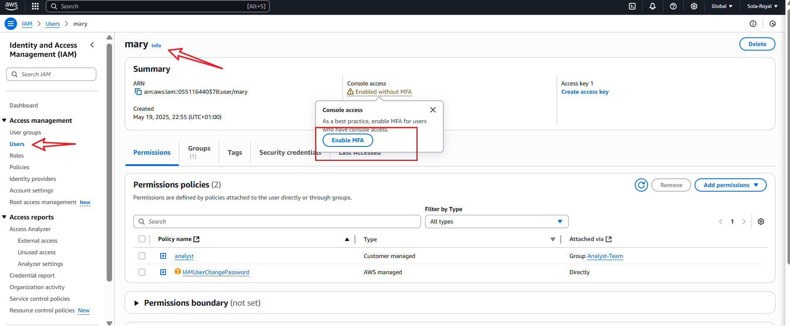
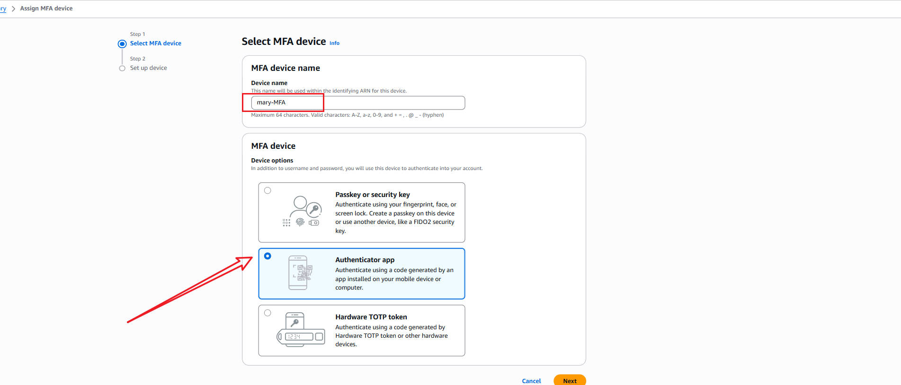
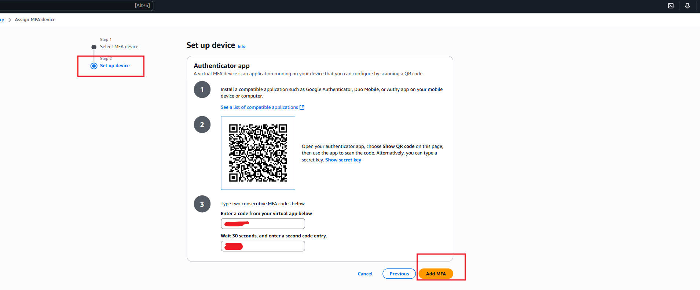
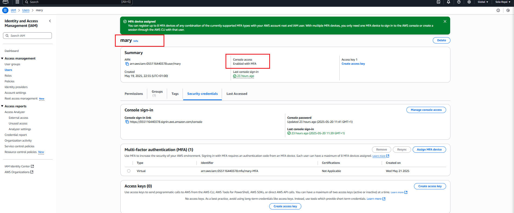

# **Security and identity access management**

>**This mini project is about AWS IAM. I will bw working on Zappy e-bank project using AWS IAM in managing cloud resources security and efficiently.**

> ## **Importance of IAM in Zappy e-Bank**
_
1. Protects Sensitive Customer Data:Zappy e-Bank deals with highly sensitive information like customer identities, bank accounts, transactions, and financial history. IAM helps ensure that only authorized staff can access this data, preventing data breaches and identity theft.
_

_
2. Enables Secure Access Control: IAM makes it easy to define who can access what within the system. IAM is like the digital gatekeeper of Zappy e-Bank — ensuring the right people have the right access to the right resources at the right time. It plays a key role in protecting customer trust, ensuring legal compliance, and keeping the bank’s systems secure and efficient.
_

_The Role of IAM in AWS Identity and Access Management (IAM) in AWS is like the security guard for your cloud resources. It makes sure that only the right people can access certain data or services. Imagine a building where you need a special pass to enter different rooms—IAM is the system that gives out those passes and checks them at the door. This helps keep everything organized and secure so that only authorized people can do certain things in your AWS environment._

> # **Project Reflection and settup**

>**Log in into the AWS management Console** 
_This my managemt Console_

_Here is the IAM dashboard_

>**Creating IAM Users** 

_an IAM USER  is a unique idnetity within an AWS acciunt that represents a person or services, granting specific permissions to access an interact with AWS s=resources under controlled and customizable security policies_

_There is a master key to building which is root user. we will not want to give the master key to `john` and `mary` because of security purpose._

_I will setup `IAM` user for a `backend developer, john`, and a `data analyst, mary`, by first determing their specific access needs_

_As a backend developer, john rewuires access to server `EC2` to run his code, necessitating an IAM user with policies granting EC2 access._

_As a data analyst, Mary needs access to data storage `AWS S3 Service`, so her IAM user should have policies enabling S3 access_

> ## **Create policy for the Development team** 

_1. In the IAM console_

_create policy_

_Search for EC2_

_selecting the `ALL EC2 actions` checkbox, selected `ALL` in the resources section_

_provided the name `developers` and description for the policy_

_Created the policy_

__The dashboard of the policy developers created__

_In `developers` policy there is an `customer managed` while on `AWS` there is `AWS managed`. it means we are in  charged_

> ## **Create policy for the Data Analyst team** 
_specify permission for s3 bucket for data analyst_

_use `analyst` as a name and the description for the data analyst S3 bucket_

_Select `all` for the permission choice_

__Next for other options before the creation and type `create policy`__

__policy analyst created and the customer managed enabled__

> ## **Create Group for the Development team** 
__In the IAM console navigation, Select `User group` and in the top right click `Create group`__

_imput the development team name `Development-Team`_

_attach the developers policy we created to the group Development-Team._

_the development team Created_

> ## **Create Group for the Data analyst team** 
__The dashboard for the resources `IAM`, there is a one user group, two roles two policy.__

_User group dashboard to create a `data analyst` group_

_imput the Analyst team name `Analyst-Team` as a name_

_attach the `analyst` policy we created to the group `Analyst-Team`._

_the group team Created successfully_

> ## **Create IAM User for john** 
__John is a backend developer to be added to Development-Team group__
_Navigate to IAM dashboard, select ` Create User`_

_imput the name `john` and review the process_

_Add the user john to development team_

__Create User__

__Download the john credentials for login__

> ## **Create IAM User for Mary** 
__Mary is a Data analyst to be added to Development-Team group__
_Navigate to IAM dashboard, select ` Create User` and _imput the name `mary` and review the process__

_Add the user mary to development team_

__Create User__

__Download the mary credentials for login after successfull creation__

_Difference Between IAM Users and Groups IAM users are like individual people with their own keys to the building. Each user has their own login and permissions. IAM groups, on the other hand, are like teams. Instead of giving each person separate permissions, you can put them in a group and give the group the access it needs. For example, if you have five developers, you add them to a "Developers" group and set the permissions for the group once, rather than for each person separately._

_How IAM Policies are Created Creating an IAM policy is like writing a set of rules for what someone can and cannot do. First, you decide what actions you want to allow or block (like reading data, updating files, or deleting resources). Then, you write these rules in a policy, which is just a document that AWS understands. Finally, you attach this policy to a user or a group, which gives them the permissions you specified._

> ## **Testing and validation** 
__To validate john permission__
_login as john, using the credential downloaded into the AWS management console_

_John Console management dashboard_

_Navigating to EC2 instance for the policy cretaed only_

_Attempting to use ssh and creating new instance it was denied_

_acees denied_

_it has access to operate on EC2 suh as `Start, stop running and so on_

__To validate mary permission__
_login as mary, using the credential downloaded into the AWS management console_
_Changing mary password_

_Mary dashboard on the management console_

_Mary access to S3 bucket only and creation_

_Creating s3 bucket named `Mary bucket`_

_Create the bucket_

__The s3 buckety for storage created successfully__

_perfroming s3 action by uploading file into the storage_

_Uploading file/folder_

__selecting file for uploading__

_File uploaded succesfully, making a action on s3 done_

## __Validare group policy__
_Test the validation and autorization, mary was not autorised into EC2 instance because the permission was for only S3 bucket_

_crearing a user by herself also denied_

__John in Development-Team group Validation__
_all thge security access was denied_

_creating user into group was also denied_

> ## **Implememt Multi-Factor Authentication** 
_Multi-factor authentication(MFA) is a security feature that adds an extra layer of protection to your AWS account and resources. With MFA ebabled, user are required to provide two or more fe=orms of authentication before they can access AWS resources_

 __Create and setting up MFA for john__ 
 _Click user and click on john_
 
 _input the name for MFA `john-MFA`, and pick authenticator app_
 
 _Open google authenticator to scan the code for MFA_

_by completing step 1-5, MFA will be enabled for john_

__Setting up MFA for Mary__ 
 _Click user and click on mary_
 
_Click on the enabled MFA as shown in the image below_
 
  _input the name for MFA `john-MFA`, and pick authenticator app_
  
 _Open google authenticator to scan the code for MFA_

_by completing step 1-5, MFA will be enabled for Mary_

_The Principle of Least Privilege The principle of least privilege means only giving people access to what they absolutely need, nothing more. It’s like giving someone a key that only opens the rooms they need for their work, not the whole building. In AWS, this is important because it reduces the chance of mistakes or misuse. If someone’s account is compromised, the damage is limited because they couldn’t access things they didn’t need._

**This is all concerning The IAM and its security**
