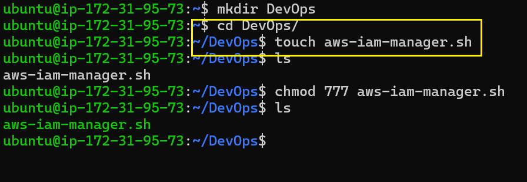
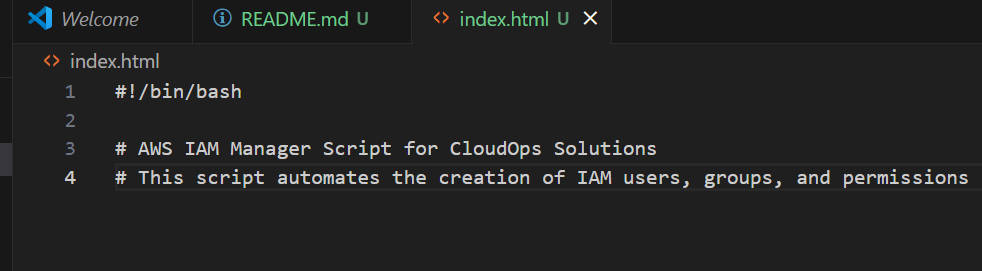
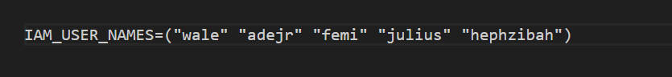
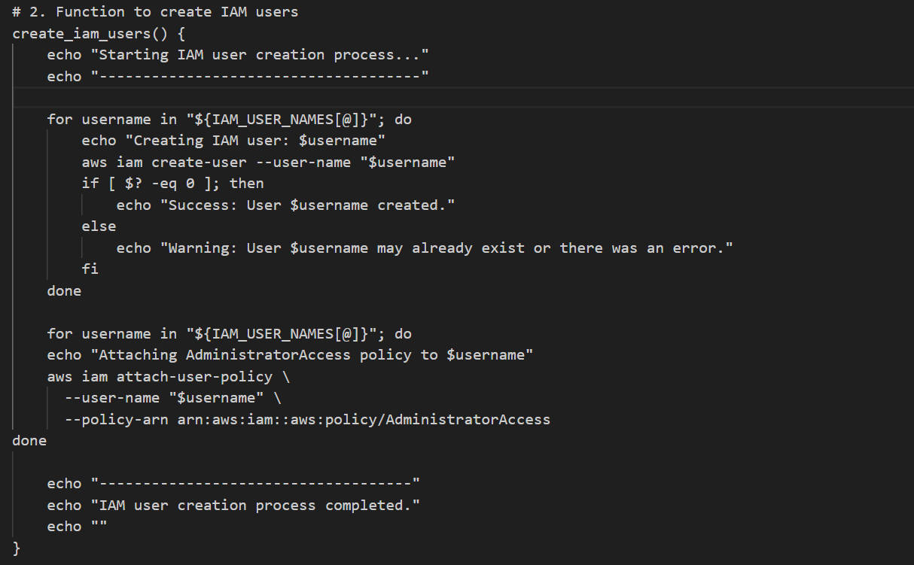
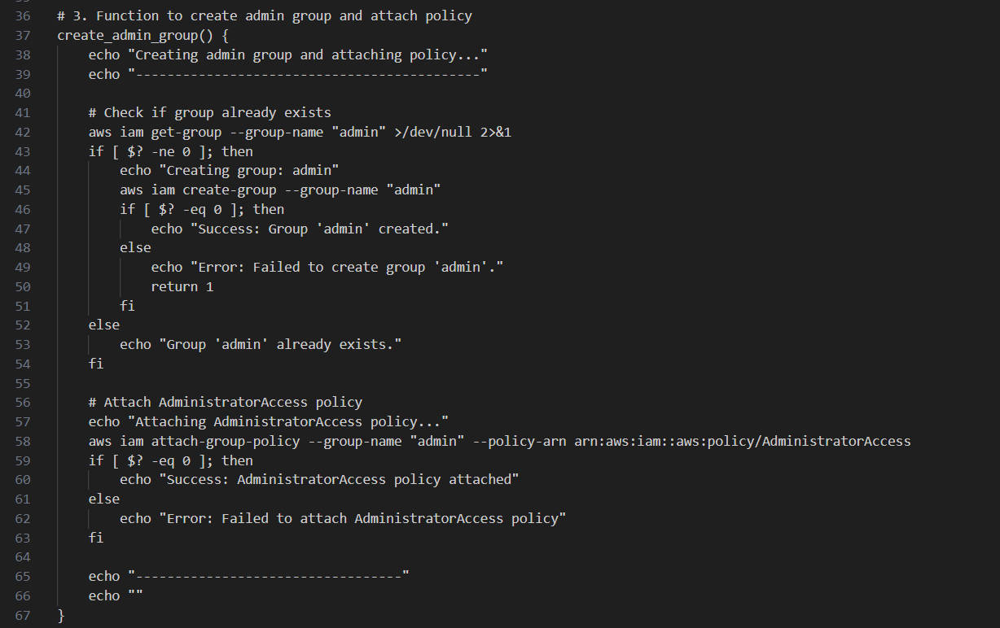
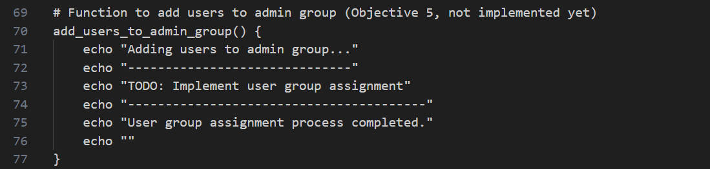
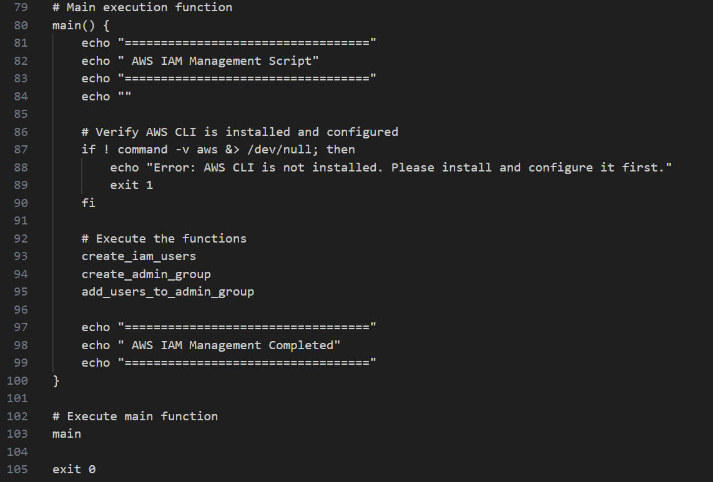
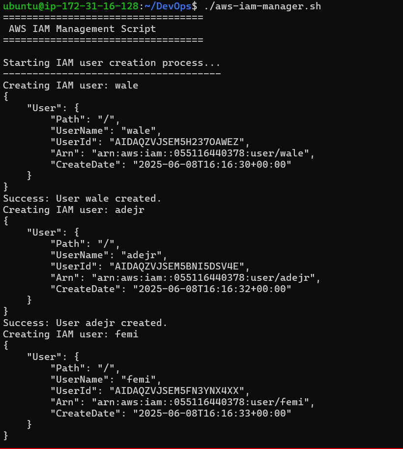
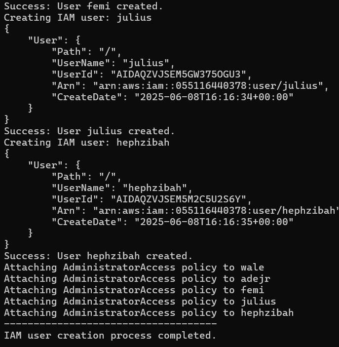
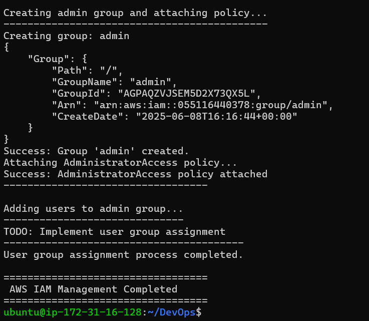

# **Shell script for AWS IAM management**

>**This Capstone project project is about Shell and AWS management. shell script is being used to write code that work with AWS direct from the CLI.**

# **1. Script Purpose**
>_**Created the bash file named `aws-iam-manager.sh`**_

_This specifies that the script should be run in the Bash shell._
_The comments describe its purpose: to automate AWS IAM user, group, and permission management._

>_**Define IAM User Names Array**_ 
_This line creates an array variable called `IAM_USER_NAMES` containing five user names._
_These names will be used to create IAM users in AWS._

>_**Function to Create IAM Users**_ 
_This function loops over each user name in the array._
_For each name, it runs aws iam create-user to create the user in AWS._
_It checks if the command succeeded ($? -eq 0), and prints a success or warning message._

>_**Function to Create Admin Group and Attach Policy**_ 
This function ensures an IAM group called "admin" exists.
It first checks if the "admin" group exists. If not, it creates it.
Afterwards, it attaches the AWS-managed "AdministratorAccess" policy to the "admin" group, giving it administrative privileges.

>_**Function Placeholder to Add Users to Admin Group**_ 
_This is a placeholder function. It’s meant to add the created users to the "admin" group, but the code isn’t implemented yet._
_It just prints messages for now._

>_**Main Function and Script Execution**_ 
_This is the main entry point for the script._
_It prints headers, checks if the AWS CLI tool is installed, and then runs the three main functions in order._

_The Script Executionc alls the main function to start the process_
_exit 0 ensures the script exits successfully._

>_**The output of the implementation**_ 

>_**The Link**_ 
[Link to the extended script](https://github.com/rotbaj/DevOps_3MTT/blob/main/Environment/3MTT/tasks/IAM_Shell_Scripting/index.sh)

**This is all concerning Shell script for AWS IAM management**
