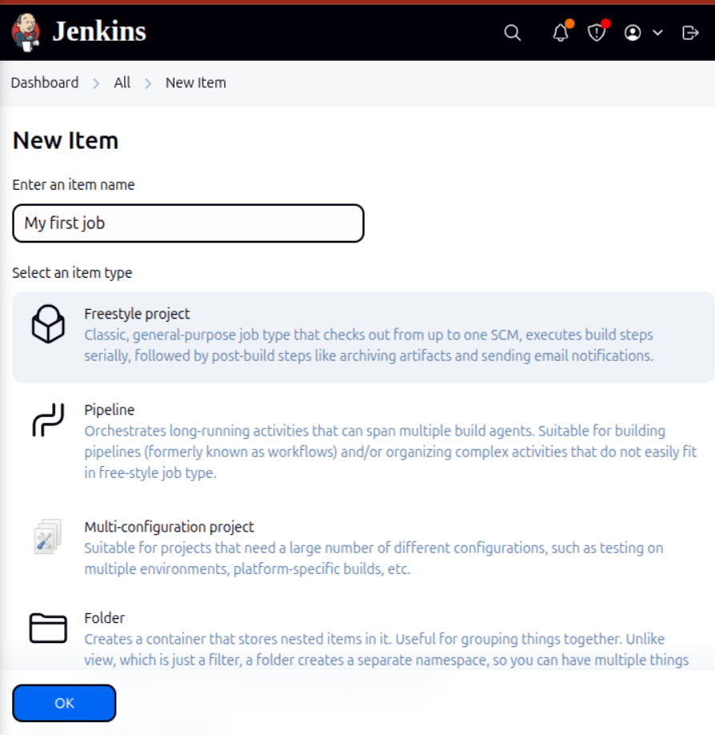
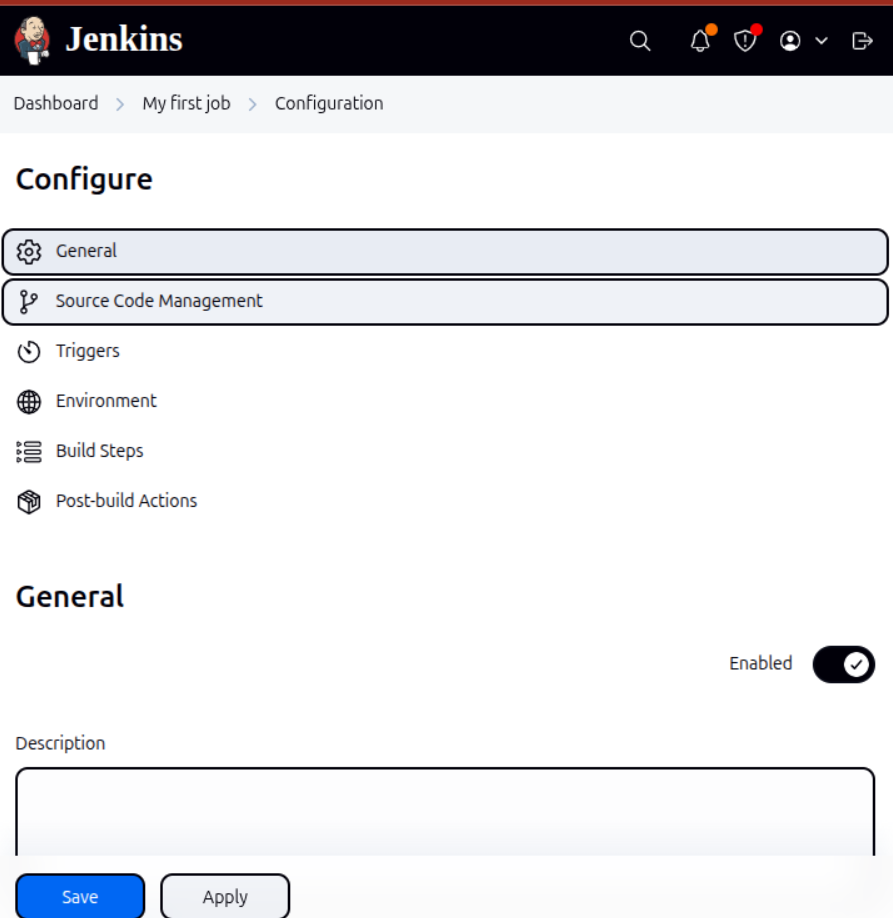
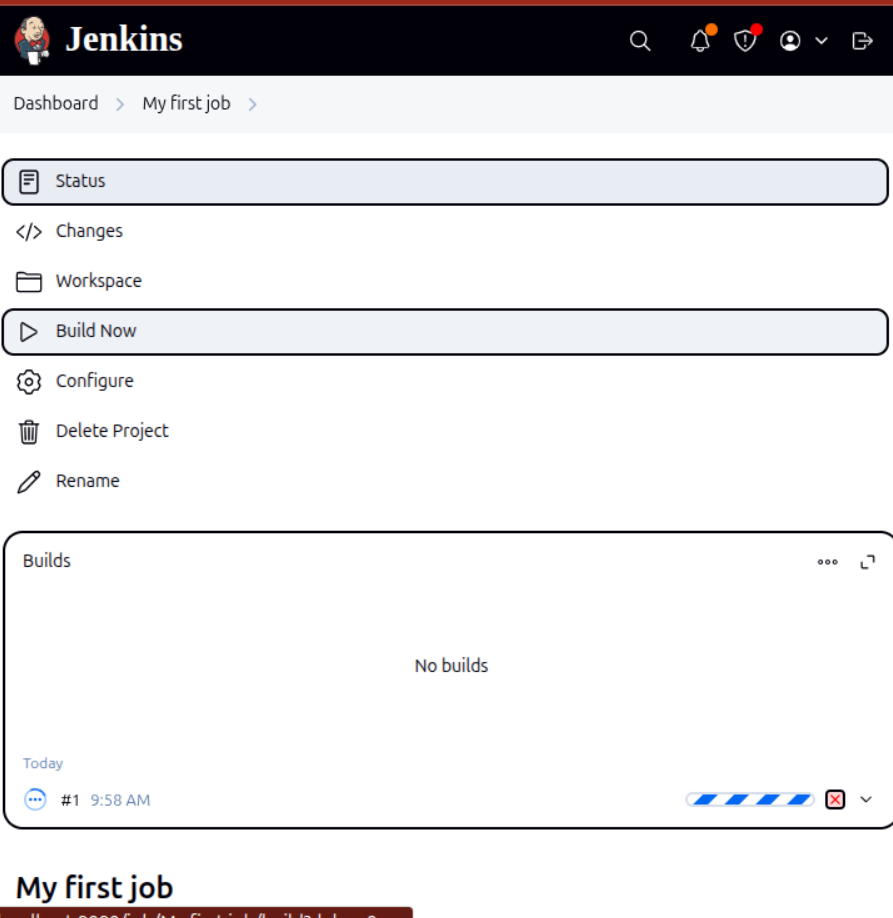
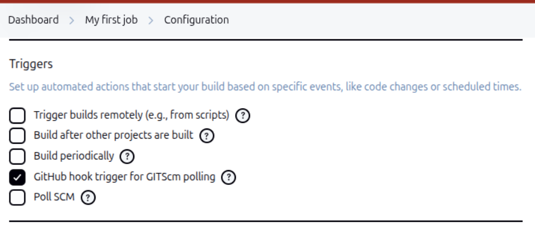

# ⚙️ Jenkins Freestyle Project – “my‑first‑job”

This is my documentation of setting up my very first Jenkins **Freestyle Job**. My goal was to connect Jenkins to a GitHub repository and set up webhooks so that every push to GitHub would automatically trigger a build in Jenkins. Here’s how I did it, step by step.

---

## 📝 What I Learned About Jenkins Jobs

A Jenkins **job** (or project) is basically a set of instructions Jenkins follows to do things like compile code, run tests, package artifacts, or deploy applications. Each job can include:

- **Build steps** (like running shell commands, Maven, or Gradle)
- **Post‑build actions** (such as archiving results or sending notifications)
- **Triggers** (rules for when the job should run)

---

## 1️⃣ Creating My First Freestyle Job

### Step 1: New Item

1. From the Jenkins dashboard, I clicked **New Item**.
2. I named it **`my-first-job`**.
3. Selected **Freestyle project** and hit **OK**.

> 

---

## 2️⃣ Connecting Jenkins to GitHub

### Step 2: Preparing the GitHub Repo

- I created a new repository called **`jenkins-scm`** on GitHub, just with a simple `README.md` file to start.

### Step 3: Configuring Source Code Management (SCM) in Jenkins

1. In **my-first-job**, I went to **Configure**.
2. Under **Source Code Management**, I chose **Git**.
3. I pasted my repo URL (replace `<your-username>` with your actual GitHub username):

    ```
    https://github.com/<your-username>/jenkins-scm.git
    ```

4. Made sure the **Branch Specifier** was set to `*/main` (or whatever branch I wanted Jenkins to build).

> 

5. Clicked **Save** and then **Build Now** to check if Jenkins could clone the repo.

> 

---

## 3️⃣ Automating Builds with GitHub Webhook

### Step 4: Enabling Build Trigger in Jenkins

1. Back in **Configure**, I went to **Build Triggers**.
2. Checked **GitHub hook trigger for GITScm polling**.
3. Clicked **Save**.

> 

### Step 5: Creating the GitHub Webhook

1. In my GitHub repo, I went to **Settings** → **Webhooks** → **Add webhook**.
2. For the **Payload URL**, I used:

    ```
    http://<your-Jenkins-IP>:8080/github-webhook/
    ```

3. Set the **Content type** to `application/json`.
4. Selected **Just the push event** and clicked **Add webhook**.

> 

*Note: If you’re running Jenkins on a cloud VM (like EC2), make sure port 8080 is open to GitHub’s IP addresses.*

---

## 4️⃣ Testing the Automation

1. I edited the `README.md` in my GitHub repo (even just adding a line).
2. Committed and pushed the change:

    ```sh
    git add .
    git commit -m "test webhook"
    git push
    ```

3. Went back to Jenkins → **my-first-job** and saw a new build start automatically!

> 

---

## 📁 Screenshot List

Here are the screenshots I took along the way for reference:

```
img/
├── freestyle-new-item.png
├── freestyle-scm-url.png
├── freestyle-first-build.png
├── freestyle-build-trigger.png
├── github-webhook.png
├── freestyle-auto-build.png
```

---

## ✅ Summary

Here’s what I accomplished in this learning journey:

| Task                    | Status |
|-------------------------|--------|
| Create Freestyle Job    | ✅     |
| Attach GitHub SCM       | ✅     |
| Manual Build Success    | ✅     |
| Webhook Triggered Build | ✅     |

I’m really happy I got everything working—from creating the job, connecting it to GitHub, and finally seeing Jenkins build automatically whenever I push changes. This was a great hands-on way to understand how Jenkins and GitHub can work together.