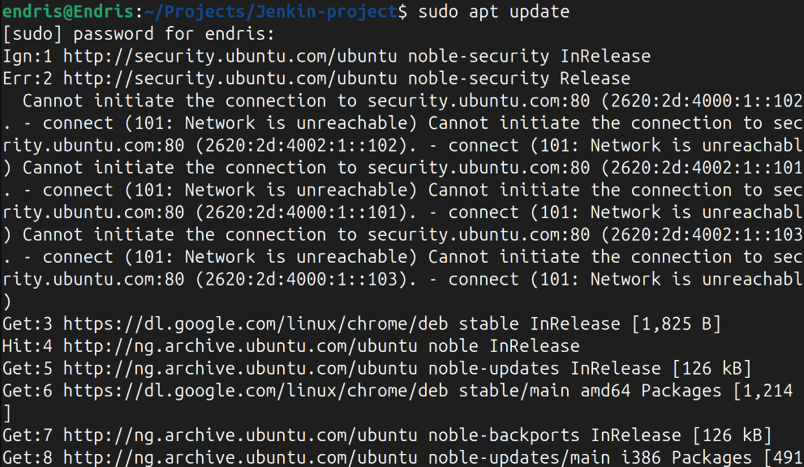
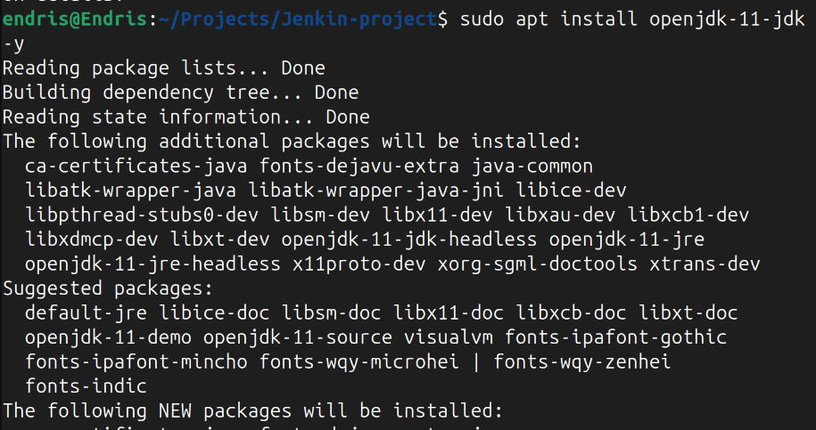
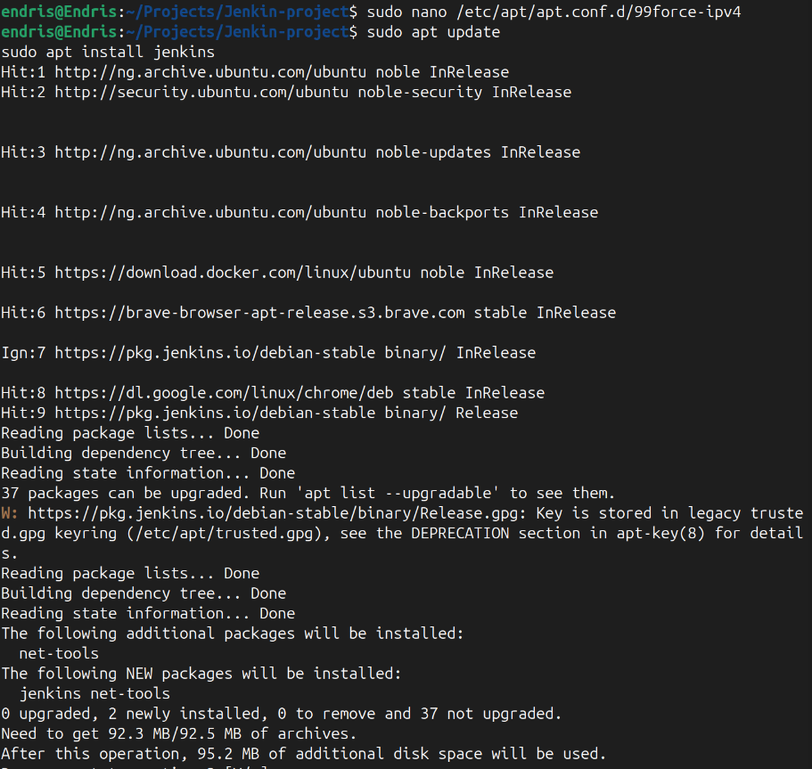
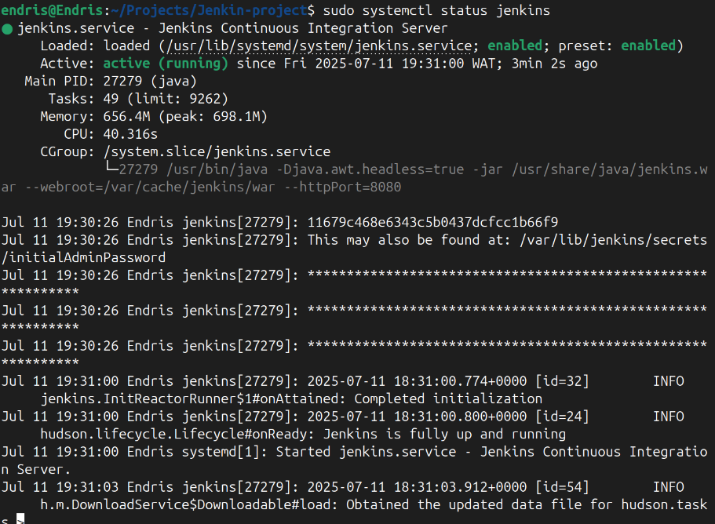
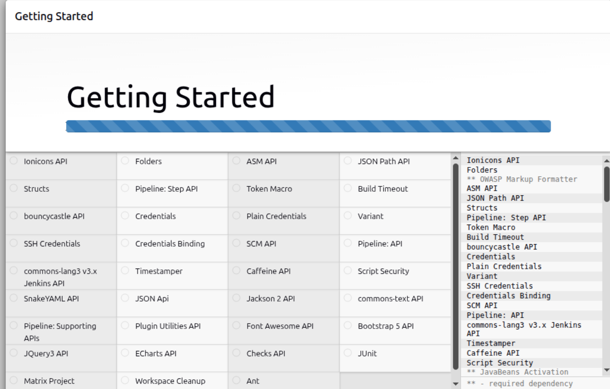
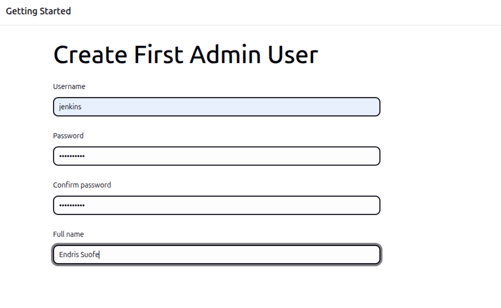
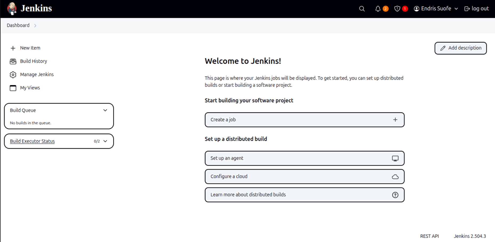

# 🧩 Jenkins Project – Introduction to CI/CD

This project documents my journey setting up **Jenkins** on a Linux machine (with an option for AWS EC2) and exploring the basics of **CI/CD** (Continuous Integration and Continuous Delivery).

---

## 🚀 What is CI/CD?

**CI/CD** is a modern software development approach that helps teams ship code faster and with fewer errors.

- **Continuous Integration (CI):** Developers push code changes regularly. Jenkins automatically builds and tests the code to catch errors early.
- **Continuous Delivery/Deployment (CD):** Jenkins ensures code is always in a deployable state, and can even automate deployment.

CI/CD reduces manual work, encourages frequent releases, and builds confidence in the codebase.

---

## 🔧 What is Jenkins?

Jenkins is an open-source automation server used to automate builds, tests, and deployments. It supports version control (like Git) and allows users to define pipelines as code, helping build consistent, repeatable workflows.

---

## 📝 Prerequisites

- Foundation Core Programs 1 – 3
- Basic Linux operations
- (Optional) Hands-on with EC2 and package management

---

## 🎯 Project Goals

- Understand Jenkins and how it fits into CI/CD
- Install and run Jenkins on a Linux machine (or EC2 instance)
- Access Jenkins from the browser and complete the initial setup
- Land on the Jenkins dashboard successfully

---

## 🛠️ Jenkins Installation

You can install Jenkins on **any Linux machine** (local or AWS EC2). The steps are almost identical, but EC2 requires extra network configuration.

### Option 1: Install Jenkins on Local Linux

1. **Update Repositories**
    ```bash
    sudo apt update
    ```
    > 

2. **Install Java JDK**
    ```bash
    sudo apt install openjdk-11-jdk -y
    ```
    > 

3. **Install Jenkins**
    ```bash
    wget -q -O - https://pkg.jenkins.io/debian-stable/jenkins.io.key | sudo apt-key add -
    sudo sh -c 'echo deb https://pkg.jenkins.io/debian-stable binary/ > /etc/apt/sources.list.d/jenkins.list'
    sudo apt update
    sudo apt-get install jenkins -y
    ```
    > 

4. **Start and Check Jenkins Service**
    ```bash
    sudo systemctl start jenkins
    sudo systemctl status jenkins
    ```
    > 

5. **(Optional) Open Port 8080 on Firewall**
    ```bash
    sudo ufw allow 8080
    ```

---

### Option 2: Install Jenkins on AWS EC2

1. **Launch an Ubuntu EC2 Instance**
    - Choose Ubuntu Server (20.04 or later)
    - Set security group to allow SSH (22) and **Custom TCP 8080** from your IP or `0.0.0.0/0` (for testing)

2. **SSH into Your Instance**
    ```bash
    ssh -i <your-key.pem> ubuntu@<ec2-public-ip>
    ```

3. **Follow the same installation steps as Local Linux above**

4. **Ensure Port 8080 is open in your EC2 Security Group**
    - Type: Custom TCP
    - Port: 8080
    - Source: Anywhere (0.0.0.0/0) or restrict as needed

---

## 🌐 Accessing Jenkins

1. **Open Jenkins in your browser:**
    - Local: [http://localhost:8080](http://localhost:8080)
    - EC2: [http://<ec2-public-ip>:8080](http://<ec2-public-ip>:8080)

2. **Unlock Jenkins**
    ```bash
    sudo cat /var/lib/jenkins/secrets/initialAdminPassword
    ```

3. **Install Suggested Plugins**
    > 

4. **Create Admin User**
    > 

5. **Jenkins Dashboard**
    > 

---

## ⚙️ Jenkins Jobs: Freestyle & Pipeline

### 1. Freestyle Job – Hello World CI

- **Create a New Freestyle Project**
    - Jenkins dashboard → **New Item** → Name: `hello-world-job` → Type: Freestyle Project
    > 

- **Add a Build Step**
    - Build → Add build step → Execute shell:
    ```bash
    echo "Hello, Jenkins! This is my first freestyle job."
    ```
    > 

- **Run the Job**
    - Save → Build Now → View Console Output
    > 

- **GitHub Integration (Basic)**
    - Source Code Management → Git → Add your repo URL
    - Add shell step:
    ```bash
    ls -la
    cat README.md
    ```
    > 

---

### 2. Pipeline Job – CI as Code

- **Create a Pipeline Job**
    - Jenkins dashboard → New Item → Name: `pipeline-demo-job` → Type: Pipeline
    > 

- **Jenkinsfile Setup (From GitHub)**
    - Use a repo with a `Jenkinsfile` in the root directory.
    - Example:
    ```groovy
    pipeline {
        agent any
        stages {
            stage('Clone Repo') {
                steps {
                    git 'https://github.com/<your-username>/jenkins-demo-repo.git'
                }
            }
            stage('Build') {
                steps {
                    echo 'Running build stage...'
                    ls
                }
            }
            stage('Test') {
                steps {
                    echo 'Running test stage...'
                }
            }
        }
    }
    ```
    > 

- **Run and Monitor Pipeline**
    - Build Now → Watch stages → Check Console Output
    > 

---

## 📁 Screenshot Directory

All screenshots are saved in the `img/` folder:

```
img/
├── update-packages.png
├── install-jdk.png
├── install-jenkins.png
├── check-jenkins-status.png
├── install-suggested-pluggins.png
├── create-jenkins-user.png
├── jenkins-dashboard.png
├── freestyle-new-item.png
├── freestyle-shell-command.png
├── freestyle-console-output.png
├── freestyle-git-clone.png
├── pipeline-new-item.png
├── pipeline-script-config.png
├── pipeline-console-output.png
```

---

## 📝 Summary

In this project, I:

- Learned the fundamentals of CI/CD and how Jenkins fits into the process
- Installed Jenkins on my local Linux machine, with clear instructions for AWS EC2 as an alternative option
- Configured network/firewall settings to allow access to Jenkins (port 8080) for both local and cloud environments
- Completed the initial Jenkins setup through the browser, including unlocking Jenkins, installing plugins, and creating an admin user
- Explored Jenkins by creating both Freestyle and Pipeline jobs, including basic GitHub integration and pipeline-as-code examples


---

## 💡 Notes

- For more details, see the [official Jenkins documentation](https://www.jenkins.io/doc/book/installing/).
- If using a cloud VM other than EC2, adjust firewall/security group settings as needed to allow access to port 8080.
