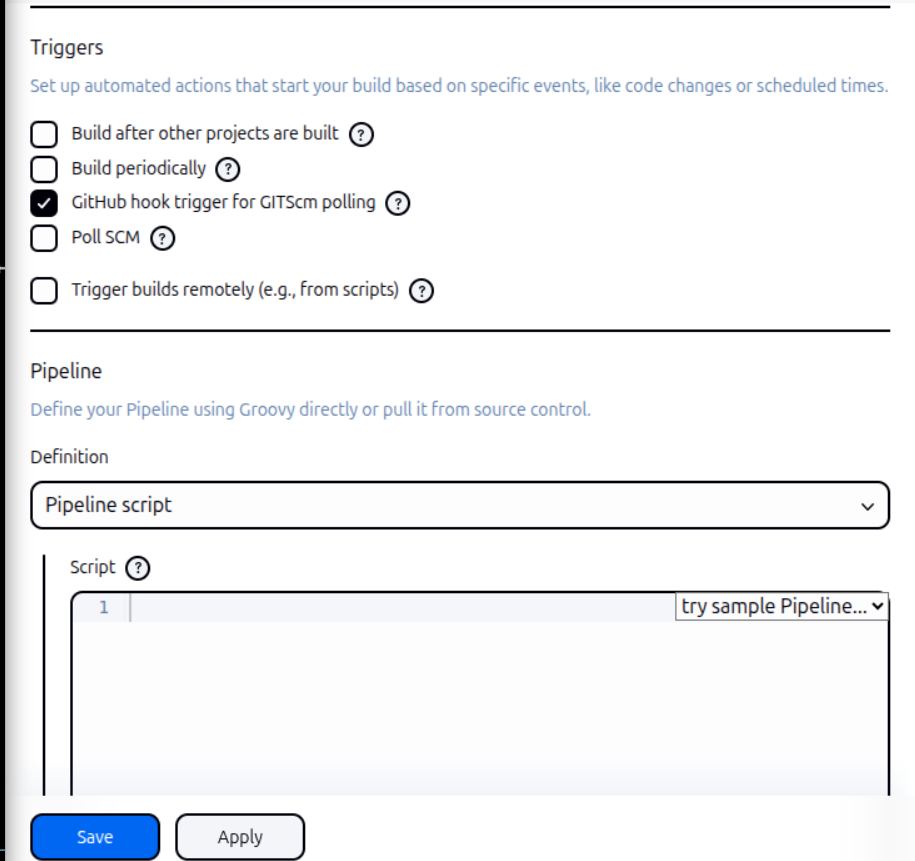
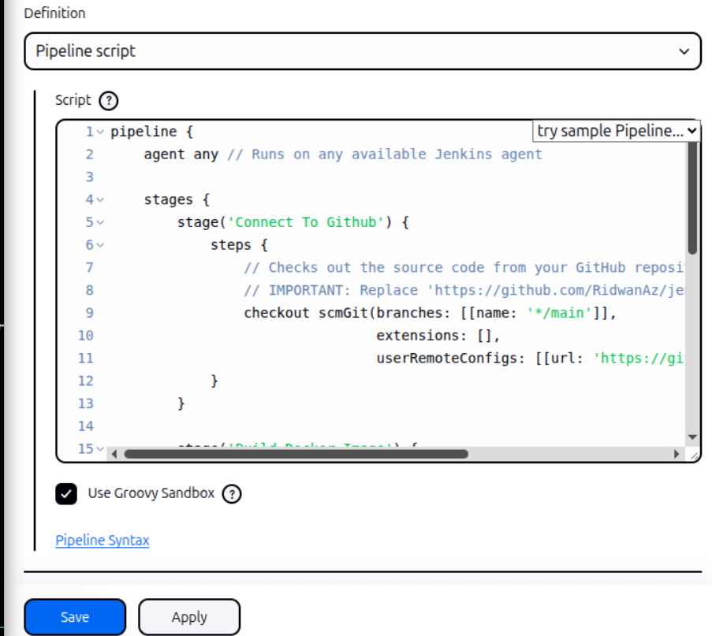
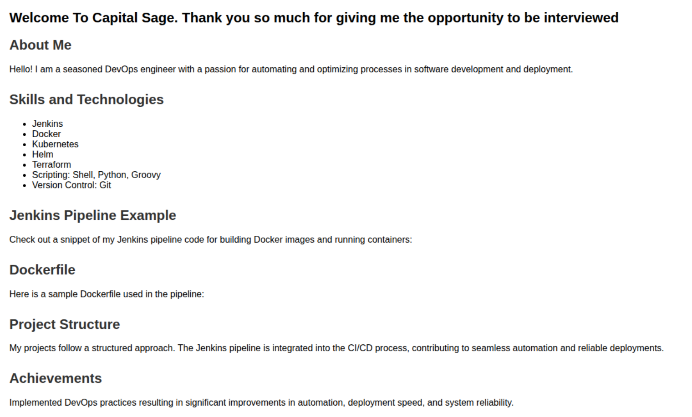

## Project: Jenkins-Docker CI/CD Pipeline 🐳🚀

This repository contains the `Dockerfile` and `index.html` necessary for a web application, which is automatically built and deployed using a Jenkins CI/CD pipeline. The pipeline leverages Docker to create an image and run a container, exposing the web application.

-----

### 🌟 Overview

This project demonstrates a basic **Continuous Integration/Continuous Delivery (CI/CD) pipeline** using **Jenkins** to automate the build and deployment of a simple Nginx web application packaged as a **Docker container**. Any push to the `main` branch of this repository triggers the Jenkins pipeline.

-----

### ⚙️ Technologies Used

  * **Jenkins:** Automation server for CI/CD.
  * **Docker:** Containerization platform.
  * **Git/GitHub:** Version control and source code management.
  * **Nginx:** Web server (running inside the Docker container).
  * **Java (OpenJDK 17):** Prerequisite for Jenkins.
  * **Ubuntu Server (or similar Debian-based Linux):** Operating System for Jenkins and Docker host.

-----

### ➡️ Prerequisites

Before you begin, ensure you have the following already set up on your Linux server:

  * **Jenkins:** A running Jenkins instance, accessible via its web interface.

  * **Docker Engine:** Docker installed and running on the same server as Jenkins.

  * **Java (OpenJDK 17 or higher):** Installed and configured as the default Java runtime for Jenkins.

      * **Crucial step:** Ensure the `jenkins` user is added to the `docker` group so Jenkins can execute Docker commands without permission errors. After adding, restart Jenkins.
        ```bash
        sudo usermod -aG docker jenkins
        sudo systemctl restart docker
        sudo systemctl restart jenkins
        ```

-----

### 🚀 CI/CD Pipeline Workflow

1.  **Code Commit:** Developer pushes changes to the `main` branch of this GitHub repository.
2.  **Webhook Trigger:** A GitHub webhook (pre-configured) notifies Jenkins of the new commit.
3.  **Jenkins Pipeline Execution:**
      * **Connect to GitHub:** Jenkins checks out the latest code from the repository.
      * **Build Docker Image:** Jenkins builds a Docker image using the `Dockerfile` in the repository.
      * **Run Docker Container:** Jenkins stops any existing container with the same name, then runs a new Docker container from the newly built image, mapping host port `8081` to container port `80`.
4.  **Application Deployment:** The web application is now accessible via the host machine's IP address on port `8081`.

-----

### 🛠️ Setup Guide

Follow these steps to configure the Jenkins Pipeline.

#### 1\. Configure Jenkins Pipeline Job

1.  **Access Jenkins UI:** Log in to your Jenkins dashboard (`http://<Your_Server_IP_Address>:8080`).
2.  **Create a New Item:** From the Jenkins Dashboard, click **"New Item"** on the left-hand menu.
      * 
3.  **Name and Type:**
      * Enter a descriptive **Item name**, e.g., `My-Docker-Pipeline`.
      * Select **"Pipeline"** as the item type.
      * Click **"OK"** or **"Create"**.
      * 

>

#### 2\. Configure Build Triggers

1.  In your newly created pipeline job's configuration page, scroll down to the **"Build Triggers"** section.
2.  Check the box for **"GitHub hook trigger for GITScm polling"**. This ensures Jenkins listens for push events from GitHub.
      * 

>

#### 3\. Define the Pipeline Script

1.  Scroll down to the **"Pipeline"** section in the job configuration.

2.  From the **"Definition"** dropdown, select **"Pipeline script"**.

3.  Paste the following **Declarative Pipeline script** into the "Script" text area:

    ```groovy
    pipeline {
        agent any // Runs on any available Jenkins agent

        stages {
            stage('Connect To Github') {
                steps {
                    // Checks out the source code from your GitHub repository.
                    // IMPORTANT: Replace 'https://github.com/RidwanAz/jenkins-scm.git' with YOUR repository URL.
                    checkout scmGit(branches: [[name: '*/main']],
                                    extensions: [],
                                    userRemoteConfigs: [[url: 'https://github.com/RidwanAz/jenkins-scm.git']])
                }
            }

            stage('Build Docker Image') {
                steps {
                    script {
                        // Builds a Docker image named 'dockerfile' from the Dockerfile in the repo.
                        sh 'docker build -t dockerfile .'
                    }
                }
            }

            stage('Run Docker Container') {
                steps {
                    script {
                        // Stops and removes any existing container named 'nginx' to avoid conflicts.
                        sh 'docker rm -f nginx || true'
                        // Runs a new Docker container in detached mode, named 'nginx'.
                        // Maps host port 8081 to container port 80.
                        sh 'docker run -itd --name nginx -p 8081:80 dockerfile'
                    }
                }
            }
        }
    }
    ```

4.  Click **"Save"** at the bottom of the page.

      * 

 >     

#### 4\. Prepare GitHub Repository

Ensure your GitHub repository (e.g., `https://github.com/endrissuofe/jenkins-scm.git`) contains the following files in its `main` branch:

  * **`Dockerfile`**: Defines how your Docker image is built.
    ```dockerfile
    # Use an official Nginx image as the base
    FROM nginx:latest

    # Remove the default Nginx index.html
    RUN rm /etc/nginx/html/index.html

    # Copy your custom index.html into the Nginx web root
    COPY index.html /usr/share/nginx/html/

    # Expose port 80 (Nginx default)
    EXPOSE 80

    # Start Nginx when the container launches
    CMD ["nginx", "-g", "daemon off;"]
    ```
  * **`index.html`**: The simple web page content.
    ```html
    <!DOCTYPE html>
    <html>
    <head>
        <title>My Jenkins Docker Page</title>
        <style>
            body {
                font-family: Arial, sans-serif;
                background-color: #f0f0f0;
                text-align: center;
                padding-top: 50px;
            }
            h1 {
                color: #333;
            }
            p {
                color: #666;
            }
        </style>
    </head>
    <body>
        <h1>Hello from Jenkins!</h1>
        <p>This page was served from a Docker container built and deployed by a Jenkins Pipeline.</p>
    </body>
    </html>
    ```
  * **Commit and push** these files to the `main` branch of your GitHub repository. This push will automatically trigger your Jenkins pipeline.

-----

### 🌐 Access the Deployed Web Application

1.  **Open Port 8081 in Firewall/Security Group:** If your Jenkins server is hosted in a cloud environment (e.g., AWS, Azure, Google Cloud), you *must* add an inbound rule to your server's security group or firewall. This rule should allow **TCP traffic on port `8081`** from `0.0.0.0/0` (or a more specific IP range if required for security).
      * 
2.  **Access in Browser:** Open your web browser and navigate to `http://<Your_Jenkins_Server_IP_Address>:8081`.
      * You should see the content of your `index.html` file: "Hello from Jenkins\!".
      * 

> 
-----

### 🐛 Troubleshooting

  * **Jenkins Build Fails:** Check the Jenkins **Console Output** for the specific build (`My-Docker-Pipeline` -\> `#Build_Number` -\> `Console Output`). This provides detailed logs of each pipeline step.
  * **Docker Commands Fail:**
      * Ensure the `jenkins` user is part of the `docker` group (`groups jenkins`). If not, re-run `sudo usermod -aG docker jenkins` and `sudo systemctl restart jenkins`.
      * Verify Docker service is active (`sudo systemctl status docker`).
  * **Web Application Not Accessible (No Page Displayed):**
      * Confirm Docker container is running (`docker ps`). If not, check pipeline logs.
      * Double-check your server's firewall/security group rules for port `8081`.
      * Verify the IP address is correct.

-----