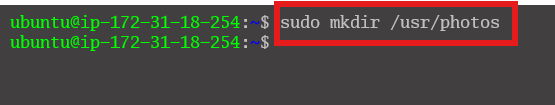
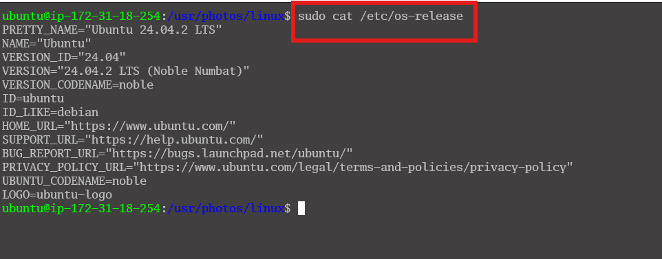

[]# Mini Project-Basic Linux Commands
## Step 0: Create a directory called `photos` inside the `/usr ` directory

## Step 1: Navigate into the ` photos` directory

## Step 2: Create 3 more random directories inside the ` photos` directory
 
## Step 3: Show the newly created directories on the terminal

## Step 4: Show the full path where you currently are on the screen

## Step 5: Displays the content of the ` os-release ` file in the `/etc/` directory using the ` cat ` command. `sudo cat /etc/os-release`

## Step 6: Use the ` cp` command to copy files or directories and their content. 

- To copy multiple files
  
- To copy the entire directory
  
## Step 7: The primary use of the mv command is to move and rename files and directories. Additionally, it doesn't produce an output upon execution.

- You can also use the `mv` command to rename a file
  
## Step 8: To remove multiple files.

## Step 9: The touch command allows you to create an empty file.

## Step 10: Use the find command to search for files within a specific directory and perform subsequent operations. Here's the general syntax: `find [option] [path] [expression]`

