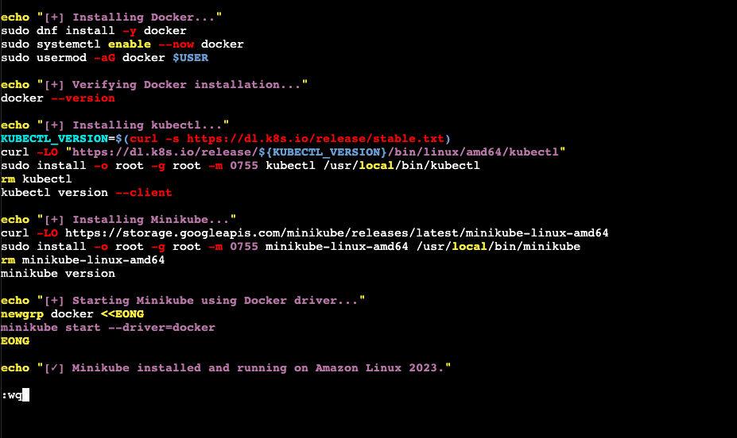
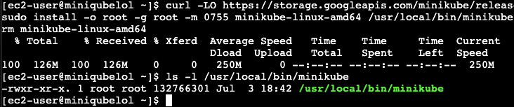
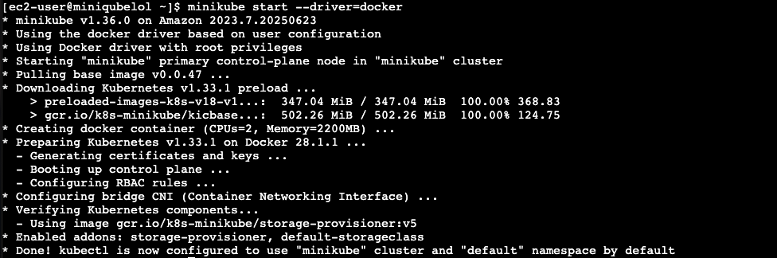
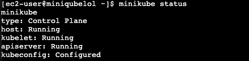
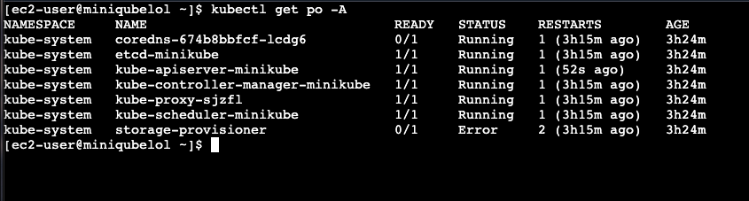
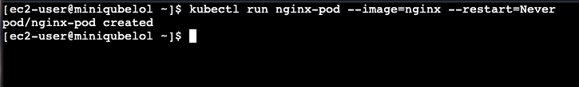
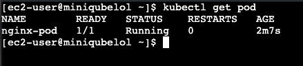
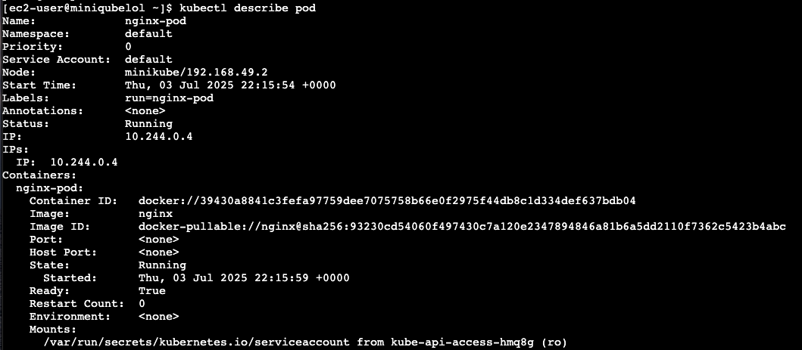
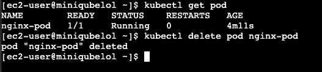

# Kubernetes
## What is kubernetes?
K8S is an open-source container orchestration platform that automates the deployment, scaling & management of containerized apps. Developed by Google and later open-sourced. K8S is widely adopted for its ability to streamline and automate the deployment, scaling & of containerized apps in a highly efficient & consistent manner. It provides a centralized platform that abstracts away the complexities of distributed systems, offering features such as automated load balancing, self-healing capabilities and seamless rolling updates.

# minikube
minikube hands-on.

### Setting up minikube on VM

1. Install `docker` first

2. Install `minikube` next

3. Start `minikube`

4. Confirm `minikube` up

### Working on minikube

Here we get to use simple k8s commands using `kubectl`

5. List pods

6. Inspect pod

7. Run a pod then get its name

9. Delete pod
