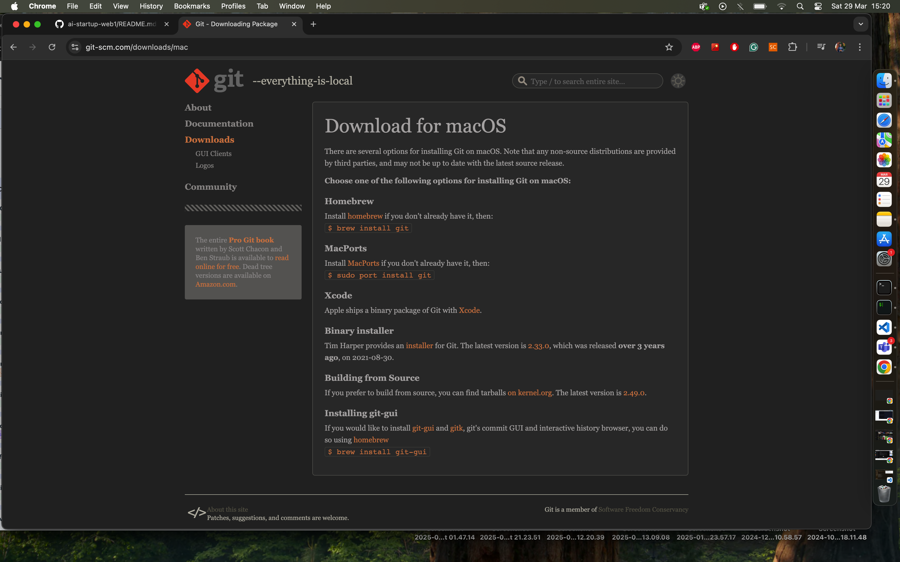
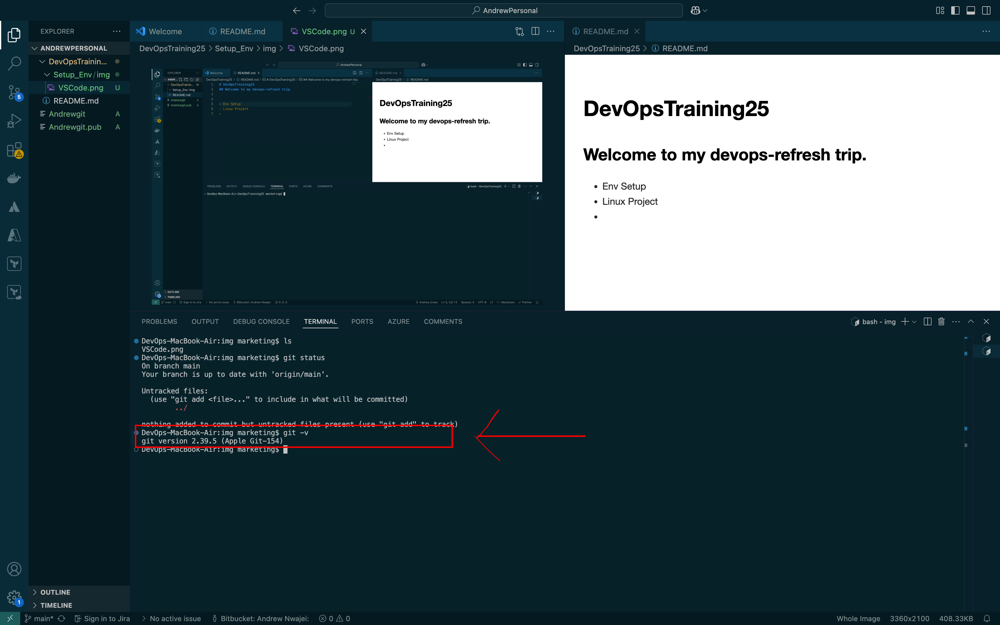
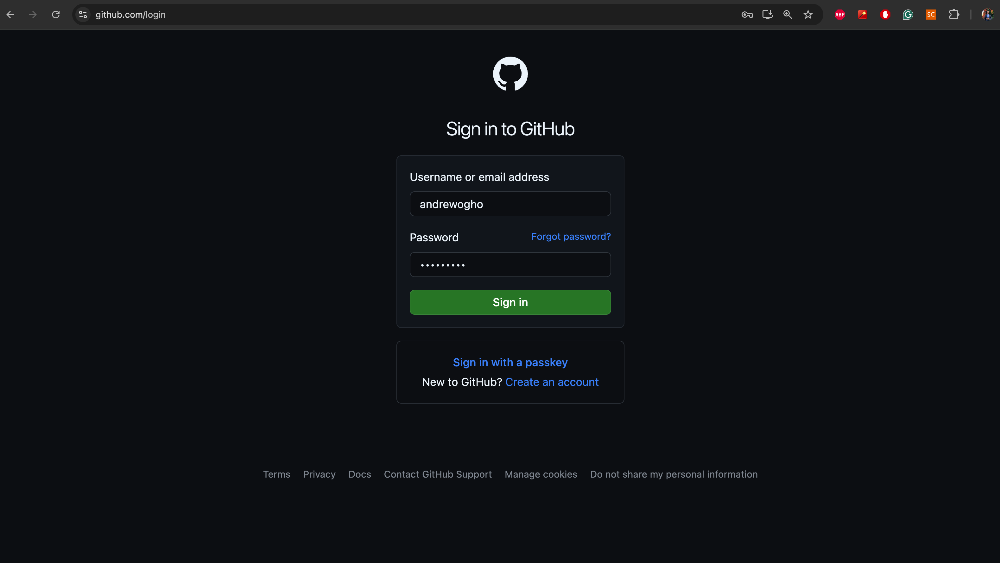
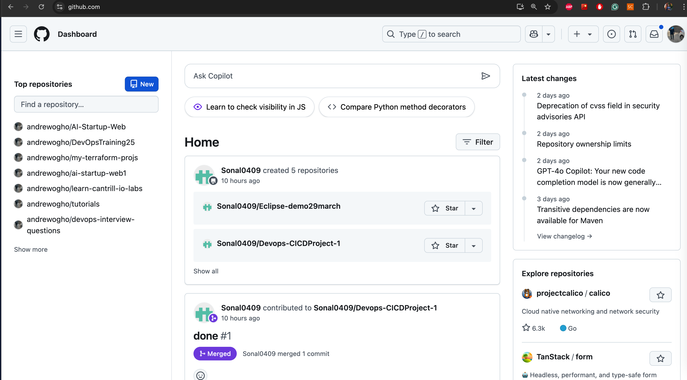
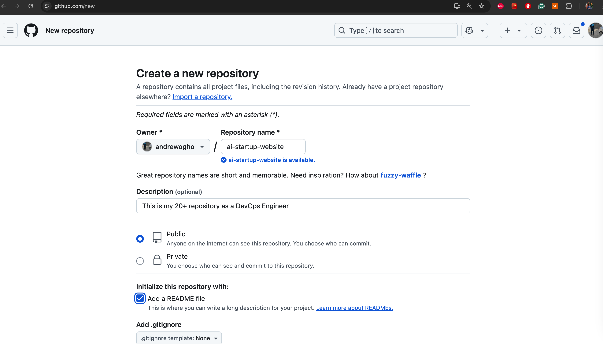
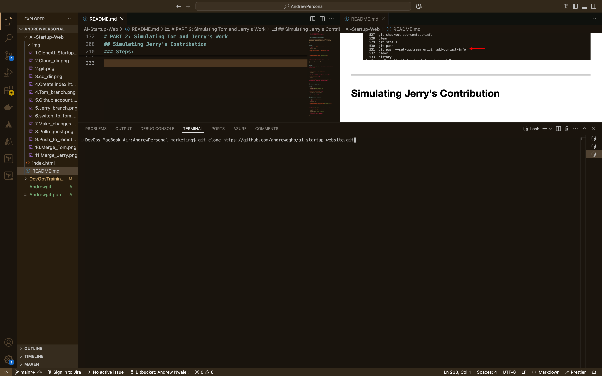
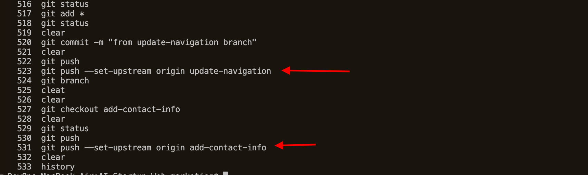
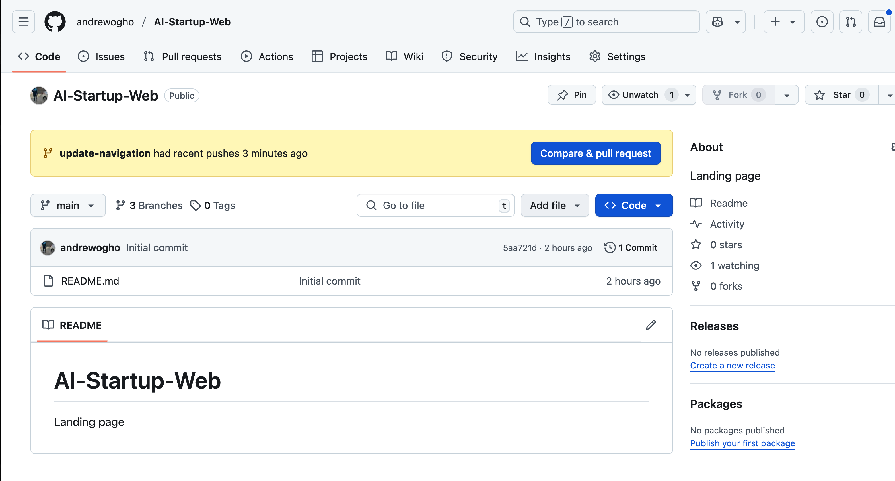
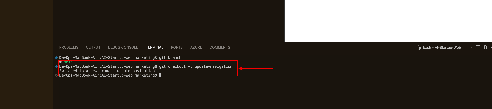

# ai-startup-website
This is my 20+ repository as a DevOps Engineer


# PART 1: GitHub Setup and Initial Configurations

This guide will walk you through the basics of using GitHub, including installing Git, creating a repository, cloning it, making changes, and pushing those changes back to GitHub. 

---

## Install Git

1. **Download Git**: 
   - Visit the official Git website: [https://git-scm.com/](https://git-scm.com/).
   - Download the appropriate version for your operating system (Windows, macOS, or Linux).


      


2. **Install Git**:
   - Follow the installation instructions for your operating system.
     ```
     sudo port install git 
     ```
        


   - Once installed, open a terminal or command prompt and verify the installation by running:
     ```bash
     git --version
     ```
   - This should display the installed version of Git.

   

---

## Login to GitHub

1. **Create a GitHub Account**:
   - If you don’t already have a GitHub account, sign up at [https://github.com/](https://github.com/).

2. **Login to GitHub**:
   - Go to [https://github.com/login](https://github.com/login) and enter your credentials to log in.

   

3. **GitHub Home page**:

    

---

## Create a GitHub Repository

1. **Create a New Repository**:
   - On GitHub, click the "+" icon in the top-right corner and select "New repository".
   - Name the repository `ai-startup-web..`.
   - Optionally, add a description.
   - Choose "Public" or "Private" visibility.
   - Check the box to "Initialize this repository with a README".
   - Click "Create repository".

   


---
---

## Clone the Repository

1. **Copy the Repository URL**:
   - On the repository page, click the "Code" button.
   - Copy the HTTPS URL (e.g., `https://github.com/andrewogho/AI-Startup-Web.git`).
    


2. **Clone the Repository Locally**:
   - Open your terminal or command prompt.
   - Create a folder named `git_project` in your desired location:
     ```bash
     mkdir git_project
     ```

     

   - Navigate into 'git_project' folder 
     ```bash
     cd git_project
     ```

     
   - Clone the repository using the copied URL:
     ```bash
     git clone https://github.com/andrewogho/AI-Startup-Web.git
     ```

     
   - Navigate into the cloned repository


---

## Make Changes and Commit

1. **Create a New File**:
   - Create an empty `index.html` file:
     ```bash
     touch index.html
     ```
   - Add some content to the file using a text editor or IDE.

   

   - Add text into `index.html` file:
    ```
    " This is the Admin creating an index.html file for Tom and Jerry. "
    ```


2. **Check Git Status**:
   - Run the following command to see the changes that have not been staged:
     ```bash
     git status
     ```
    

3. **Stage Changes**:
   - Stage all changes for commit:
     ```bash
     git add .
     ```
         

4. **Commit Changes**:
   - Commit the changes with a message:
     ```bash
     git commit -m "clear message here"
     ```

---

## Push Changes to GitHub

1. **Push to GitHub**:
   - Push the changes to the `main` branch on GitHub:
     ```bash
     git push origin main
     ```


2. **Verify on GitHub**:
   - Go to your repository on GitHub and verify that the `index.html` file has been added.

   

---

# PART 2: Simulating Tom and Jerry's Work

This guide will walk you through the basics of using GitHub, including navigating a project directory, creating branches, making changes, and collaborating with others. We'll simulate workflows for two contributors, Tom and Jerry.

---

## Navigating the Project Directory and Checking Branches

### Steps:
1. **Navigate to the project directory** you just cloned using the command:
   ```bash
   cd ai-startup-web
   ```

2. **Check the current branch in the repository** using:
   ```bash
   git branch
   ```
   

   This will display all the branches in the repository.

3. **Create a new branch called `update-navigation`:**
   ```bash
   git checkout -b update-navigation
   ```
   

4. **Verify the new branch** by running `git branch` again. You should see the newly created branch listed.

    

    


---

## Making Changes and Staging Them

### Steps:
1. Open the `index.html` file in your code editor. Since this file already exists in the main branch, it will also exist in the new branch you created.


2. **Check the status of your changes** using:
   ```bash
   git status
   ```

   This will show that the changes have not been staged yet.

4. **Stage the changes** using:
   ```bash
   git add .
   ```

5. **Confirm the staged changes** by running `git status` again. The changes should now be staged and ready to commit.


---

## Committing and Pushing Changes

### Steps:
1. **Commit the changes** with a meaningful message:
   ```bash
   git commit -m "update navigation bar"
   ```
   

2. **Push the branch to GitHub** using:
   ```bash
   git push origin update-navigation
   ```
    - Use this command to add branch if it didnt already exist in remote repo.
    ```bash
    git push --set-upstream origin update-navigation
    ```

   


---

## Simulating Jerry's Contribution

### Steps:
1. **Switch back to the main branch**:
   ```bash
   git checkout main
   ```

2. **Create a new branch for Jerry called `add-contact-info`:**
   ```bash
   git checkout -b add-contact-info
   ```

3. Make the necessary changes to the project (e.g., adding contact information to `index.html`).

4. **Stage, commit, and push Jerry's changes:**
   ```bash
   git add .
   git commit -m "add contact information"
   git push origin add-contact-info
   ```
   


---
