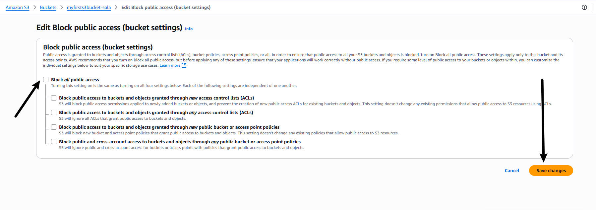
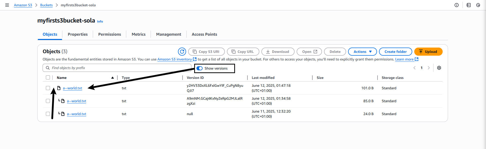

# **AWS S3 Mini Project**

>**This mini project is familiarize with Amazon S3(simple storage service) and its fundsmemtsl concept.**

> # **Amazon S3**
_
Amazon S3, or Simple Storage Service, is like a big digitsl waerehouse where you can store all kinds of data. its part of amazon web services (AWS), which is a collection of cloud computing services
_

__S3 Benefits__
_
It helps in storing data in the cloud, as a data centre you can retrieve your data anywhere. 
_

> # **Setting Up the Creation of an Amazon S3 bucket** 
> _First, navigate to the `search bar` on the Aws console, and search for `S3`_

>**Create Bucket** 
_Let proceed with creating a new  bucket named `myfirsts3bucket-sola`_

_Select `ACL Disabled` for object ownership_

_The bucket has been successfully created_

__The structure__
 

 __`ACL activated__
 
  

   __`block public access` acivated__
 
  

__(a) `Edit` to make change__

_Now `uncheck` the `Block all access` option., then click oin `save changes`_

>**object Uploading** 
_let create ba file on my laptop with some data. , we'll write `Welcome to the AWS world` and save it._

__Click `Upload button`__
_click on the `Add file` and add the file you want to upload._

__`Click open`__

__Finally `Upload` to complete the process__

__Congratultions!, it has been successfully uploaded object(file) to the S3 bucket(folder).__

> # **Enabling Version** 
_AWS versioning is a feature primarily associated with Amazon S3 (Simple Storage Service), and it refers to the ability to keep multiple variants of an object in the same bucket_

_Versioning allows you to preserve, retrieve, and restore every version of every object stored in an S3 bucket.
When versioning is enabled on a bucket, any time you upload (PUT) a new object with the same key (name) as an existing object, S3 automatically creates a new version of that object.
Each version of an object is assigned a unique version ID._

> _On the Bucket `properties` section on the righ side, you will notice that bucket versioning is currently disabled. then enable it._

__Click Edit__

__Select `Enabled` then saved__

__Modify the content and re-upload it again, i will create a new version of the file.__

__Another uploading__

##  __To view the content of all the versions, let's proceed to our next step, which involves setting permissions__

__Navigate to `permission` section and see if `Block all Public access` is enabled.__

__(a) `Edit` to make change__

_Now `uncheck` the `Block all access` option., then click oin `save changes`_

__Now, type `confirm` and click confirm__

__Bucket policy__

_click on the policy generator which also define what others can do omn your file_

__Select the type of policy as `S3 Bucket policy`__

__arn__

__Generate policy__
_Click `add statement` after inputing the actual `ARN`_

_Now, copy the `JSON` file and close it_

_Paste the policy generated to the policy and `Save`_

__set public access permission private__

_Now, click on the version of the file_

__Click on the object URl__

_Here you will see the previous data_

__If we click on the latest version and click on the object URL,__

__click on the URL__

__You will get the latest data__

##  __Creating lifecycle policies__
_Navigate to the management section of the bucket, also `The Aws version  has been updated`_

__Click on `Create lifecycle rule`__

__Give the specifications, and click to create rule__

__Now the lifecycle policy is being crated successfully__

**This is all S3 amazon bucket in a short for cloud computing**
