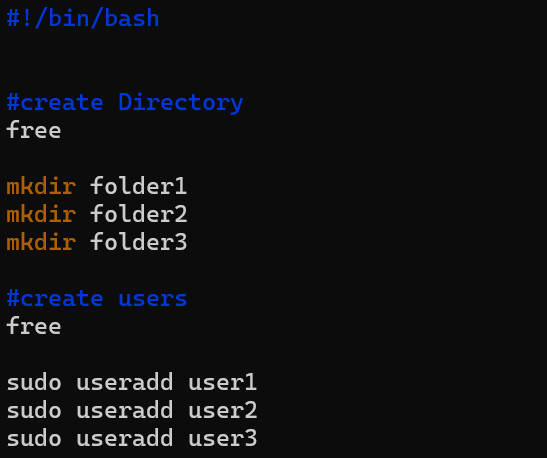

# **SHELL SCRIPTING**

>**this project is about shell scripting and its commands.**

----
>**We have shell language such as**

- `Bash`
- `sh`
- `zsh`
- `powerShell`

># **Creating a folder**
_a folder is created named `Shell-Scripting`_

_A file is created inside the shell-scripting named `my_first_shell_script.sh` to perform an executable persmission_
_i use `VIM` to open the file and use it to write a script to create `three folder` and `three users`, then execute it with `./my_first_shell_script.sh` commands._

using `ls -latr` to check the persmission list,using `chmod` to add execute and update the permision to `owner` 

`-rw-rw-r--` means the user has read(r) and write(w), group has read(r) and write(w) also, and group only has read(r)

_Using VIM to open the script and save it_

_`./my_first_shell_script.sh` for execution_

-----
># **Checking the folder**
_using the `ls` command and `id` to check the users_

># **`#!/bin/bash` called Shebang**
_shebang is a special interpreter to execute the script. in this case `#!/bin/bash` indicate bash shou;d be use to interpret and execute_  

># **The variable declaration and initialisation**
_variable is essential in every programming language. we use `=` operator to assign value to variable and we access the value using a variable name preceed by `$`_

_example: asign john to name, `name="John"`, output with `echo $name`_

**This is one example of the whole shell scripting**