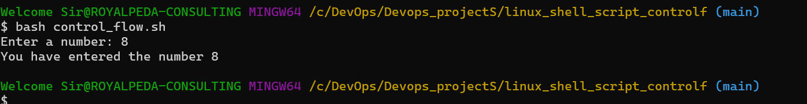
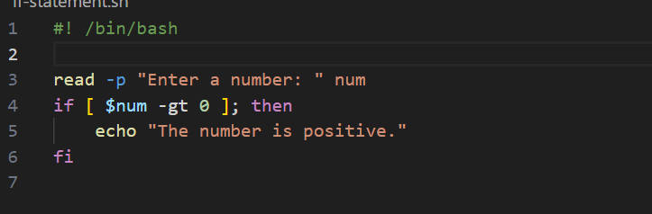

# **Shell script Control flow**

>**this mini project is about shell scripting control flow statement like if-else, for loops, while loops, and case statement to control the flow of execution in your scripts .**

----
> **Control Flow statement**
_these are_
- if-else
- for loops
- while loops
- case statements

> **if-else Statement**

>**Control Flow** 
_script named `control_flow.sh` to write and execute script_

_using `bash` to execute the script and output the program_

_updating the script_

---

>**If statement** 
_`if statement` in bash allow us to execute a statement_

_Update the script, then execute it with `./if_statement.sh` command_

---
>**elif statement** 
_after understanding the if statement, i move to `elif` which means `else if`. it aloow you to test additional condition previous if condition were not met_ 
script created `elif_statement`

># **Loop Statement** 
_loop allows you to execute a set of instruction over time without repeating set of code_

>**for_loop** 
_the for loop is use to iterate over a list of values or range of numbers_ 
script created `for_loop`

excute with `./for_loop` command

>**while_loop** 
_An until loop in Bash is used when you want to execute a block of code until a specific condition becomes true_ 
script created `until_loop`

excute with `./while_loop` command

>**until_loop** 
_This is the condition for the while loop. The loop will continue running as long as counter is less than or equal to_ 
script created `until_loop`

excute with `./until_loop` command

># **C-style form** 
_C- style is powerful in numerical condition and statement_

>**c-style_form** 
script created `c_style_form`

excute with `./for_loop` command

**This is all concerning shell script control flow**