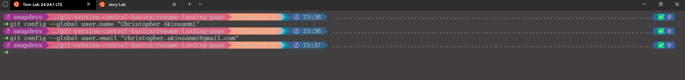

# Mini Project - Git Version Control Basics.
### Below are the detailed steps accompanied by a screenshot:
- Step 0: The git init command initialises a new Git repository.
  
#
- Step 1: The git config command is used to modify the local configuration settings of the current Git repository
   
#
- Step 2: Jerry cloned the project repository from the central repository to his local machine.
  
#
- Step 3: Tom and Jerry pull the latest changes from the central repository to ensure they start with the most current version of the index.html file.
   
   
# 
- Step 4: They both create a new branch from the main project. A branch in Git allows developers to work on a copy of the codebase without affecting the main line
          of development. Tom names his branch navbar-nav, and Jerry names his social-links.
   
  
   
# 
- Step 5: Tom and Jerry vim the index.html
  
   
  
   
#
- Step 6: The original index.html file before any edits by Tom and Jerry.
   
#
- Step 7: On their branch, Tom updates the navbar-nav in index.html and Jerry updates the social-links in index.html.
  
   
   - Jerry works on his branch to add Hashnode social link to the social-links of the same file.
     
   
#
- Step 8: Tom check the git log
   
  - Jerry check the git status
   
#
- Step 9: Jerry then pushes his updated branch and creates a PR for his changes.
  

  - Tom pushes his updated branch and creates a PR for his changes.
    
#
- Step 10: Tom checkout to main branch

   
#
- Step 11:The dashboard contains a Pull Request button accessible to both developers in the remote repository
  
