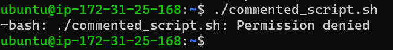
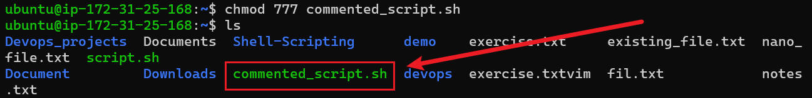
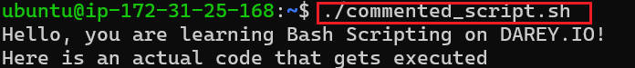

# **Adding Comments in Bash Script**

>**this project is about shell scripting comments and its properties.**

----
>**What are comments?**
_Comments are line in your code ignored by interpreter. they are usually used to explain certain thing in the code_

- `Single-line Comment`
- `Multiple single-line comment`

>**Creating a Script**
_Script named ` commented_script.sh` to carrying out bash script_

_using `VIM` text editor to open the script created and write `single-line` and `multiple single-line` comment_

_Denied execution because there was not permission_

_`chmod` command is used to change it to proper script execution_

both script executed successfully using `./commented_script.sh` command

_Single line comment start with `#` anything follow this symbol is ignored by interpreter_

># **Using Multiple single-Line comment**
_All the text after the `#` symbol were not output by echo_

# **Best practices for commenting**
1. Its use for clarityn in code
1. Maintainability
2. usefulness
3. avoid overcommenting

**This is one example of the whole shell scripting comments**