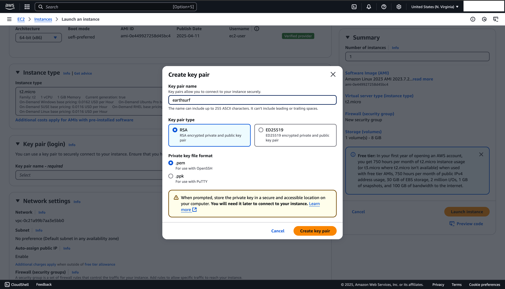
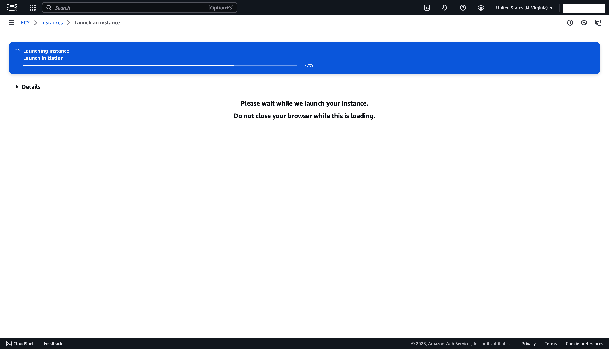
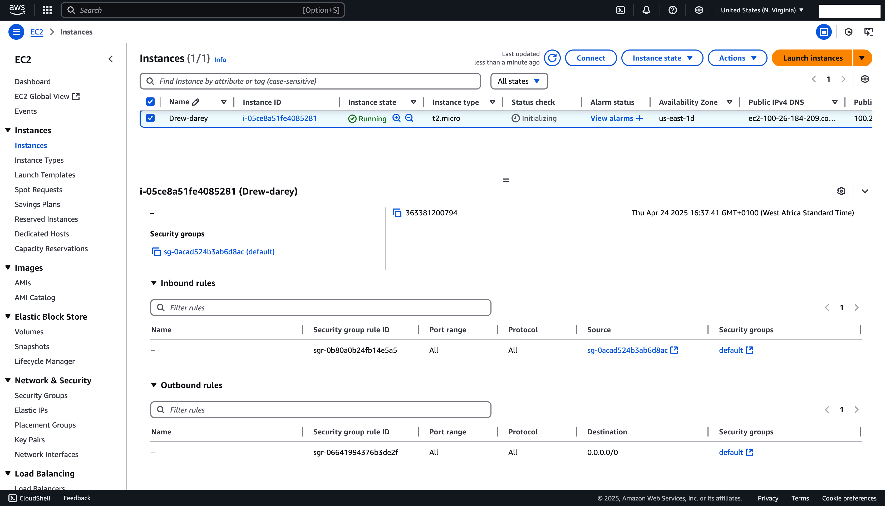
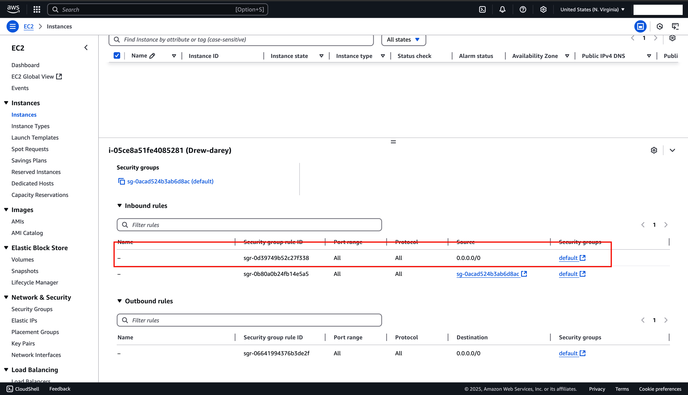

# Introduction to Linux

**1. Creating my EC2 instance:**

- Amazon Machine Image used -> Amazon Linux. 

**2. Create key pair:**

- Create a key pair `earthsurf.pem` that would be used to ssh into instance from terminal.

**3. Launching EC2 instance:**

**4. Initializing EC2:**
- Allow the newly created instance to be initialized; this would after seeing `2/2 checks passed` in the **Status check** column.

**5. Connecting using SSH (Secure Shell):**

- In the AWS GUI select the newly created instance and click on `Connect`

- Then select to the `SSH client` column

- Follow the instructions as directed by AWS.

Go to MAC terminal and change permissions on the created `earthsurf.pem` file:

``cd`` into ``Downloads`` directory where the pem file was saved

`ls -l` the contents of the `Downloads` dir

`chmod` the permissions of `earthsurf.pem` file

**6. Using the ssh command string provided, try connecting with ssh:**

- Needed to troubleshoot as ssh connection was timing out when attempted, reason was inbound rule did not allow connection from anywhere `0.0.0.0/0` (this is not best practice, only used for the purpose of this demo)

- After adding inbound rule, try again
*"success"*!

**7. Inside ssh connected instance terminal:**

   Update: 
    `sudo yum update`
    

`tree` install:
    `sudo yum install tree`
    
    

Make use of tree command:

Now add some directories and file:

Use `tree` command again:

Upgrage:

Uninstall `tree`:
`sudo yum remove tree`

Install `nginx`:
`sudo yum install nginx`

**8. Finally, terminate instance:**

- Go to AWS GUI, select running instance
- Navigate to & Click on `Instance state`
- From the drop down select `Terminate (delete) instance`

Remember to confirm instance is actually deleted.

---