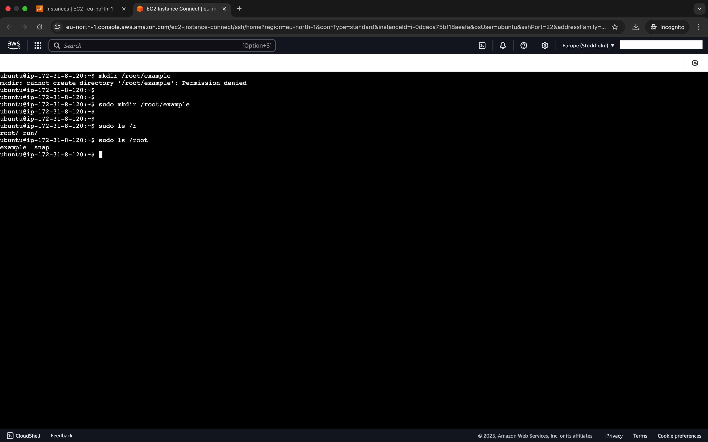

# Linux Commands

---

We will be starting off with simple basic linux commands.

Linux cmds are the way we comm with the machine. For different purposes.

---

1. Using the `sudo` command:
- Sudo cmnd is the superuserdo, it allows you admin priviledges.

`mkdir /root/example`

makedir.png)

perdeny.png)

`sudo mkdir /root/example`

sudomkd.png)

2. Using `sudo ls /root`
- `ls -lh` to list contents of specified
ls1.png)
- `ls`

ls.png)

- `ls -R`
ls2.png)

3. Side hustle task

**This task along side other examples were used for the entire basics linux commands.**

- Create a dir called 'photos' inside `/usr` dir

mkdirphotos.png)

- Add `sudo`
sudo.png)

- `cd` photos dir
ls.png)
- Confirm "photos" dir created
pwd.png)

- Create 3 more random dirs

sudo3dirs.png)

- Show recently created dir on terminal

cddir.png)

- `cd` into one of them

ls.png)

- Show the path where i currently am `pwd`

pwd.png)

4. Present working directory `pwd`

pwd.png)

5. `Cat` command

`sudo cat /etc/os-release`

cat.png)

6. `cp` command
- Copy a file from any dir to another 

cp1.png)

cp2.png)

cp3.png)
cp4.png)

cp5.png)

cp6.png)
cp7.png)

- Then copy an entire dir

 `cp -R dir-path new-dir-path`

11.png)

cp10.png)

ls2.png)

7. `mv` command

- Move file to new dir
mv.png)

mv1.png)

- Rename file with 
`mv old_filename.txt new_filename.txt`

mv3rename.png)

8. `touch` command
- `touch file`

touch.png)

9. `rm` command

- `rm filename`

rmfile.png)

- `rm -rf dir`

rminBackup.png)

rmDocs.png)

10. `ls` command
ls.png)
ls1.png)
ls2.png)

11. `find` command

find.png)