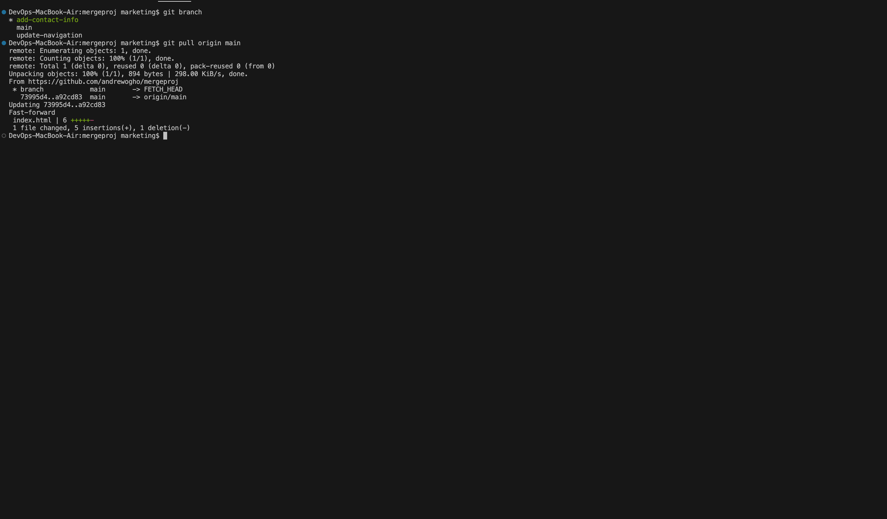

# Git Branching & Merging:

# Tom's Merge
## 1. Navigate to GitHub Repo

## 2. Switch to the Branch

- **Switch to `update-navigation` branch Tom's branch:**

## 3. Create Pull Request

- **Initiate new `Pull Request`:**

- **Open the Pull request:**

- **Add description:**

## 4. Review & Merge Pull Request
- **Review Tom's Pull Request.**

- **Make sure there are no conflicts, resolve if there is conflict:**

- **Initiate Merge Confirmation:**

---
# Jerry's Merge

## 1. On Terminal; switch to Jerry's branch: `add-contact-info`

## 2. Pull merged changes from main.

## 3. Use `git status` to see current branch status.

## 4. Jerry edits `index.html` file. 

## 5. Push committed changes from local to remote repo.

## 6. Initiate `Pull Request` for Jerry's branch.

## 7. Open Pull request.

## 8. Add a description message.

## 9. Review changes made to `index.html` file.

## 10. Confirm no merge conflicts.

## 11. Confirm merge.

## 12. Success!

---