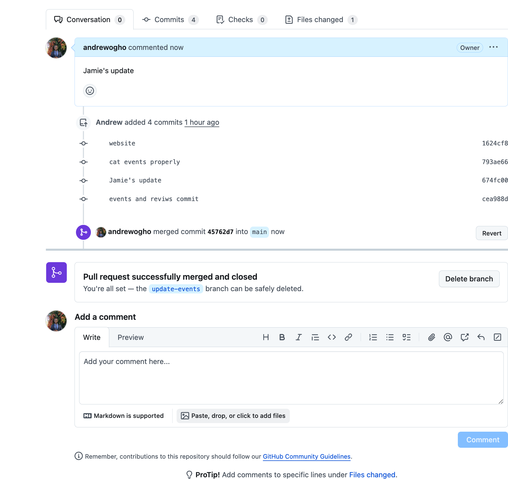

# greenwood-library-website
---

## Simulating Morgan's contribution

1. Clone remote repo from Github:

2. Add contents to newly cloned repos to simulate already present files in website repo:

3. List newly added files:

    

4. Add some contents to each file:

    
    

5. Git add:
 
    
    

6. Push to remote repo, branch:main:
 
    
    

7. Create Morgan's branch on local machine/repo:

8. Add new file `book_reviews`:

9. Add content into file and `cat` it:
    

10. Add, commit & push changes to remote repo:
    

    - Add & commit
    

    - Remote repo before push
    

    - Initiating push to remote
    
    
    - Remote repo after push
    

11. Create `Pull Request` (PR) for Morgan's contribution:
        

    
    
    
    

12. Branch contribution successfully merged:    
    
---

## Simulating Jamie's contribution    

1. Create new branch in local `update-events`:
    
    

2. Cat `events.html` file before Jamie's update:

3. Edit `events.html` file and `cat` to show update:

4. Add & Commit update:

    

5. Before creating PR we were instructed to pull main remote branch first:
 
    - Conflicts arose, troubleshooting to resolve conflict:
    
    

6. After conflict resolved, add & commit changes:

7. Push to remote and create new branch:

8. Initiate PR for Jamie's contribution:

9. Review changes:

10. Open PR:

11. Resolve any conflicts and merge:

12. Confirm PR:

---

13. Main branch with all changes merged:
