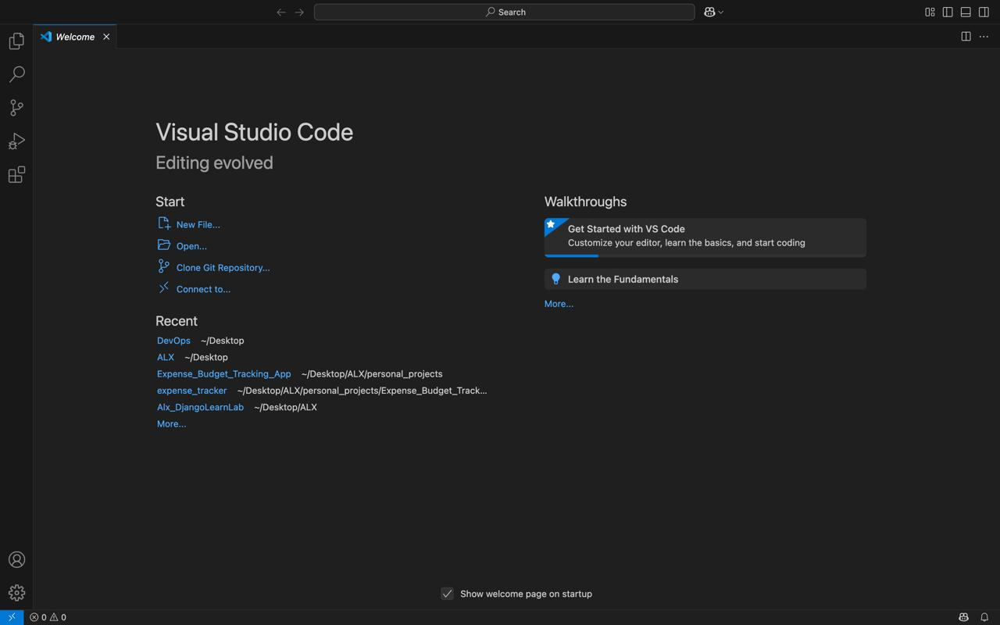
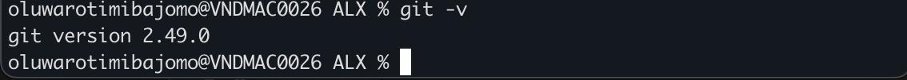
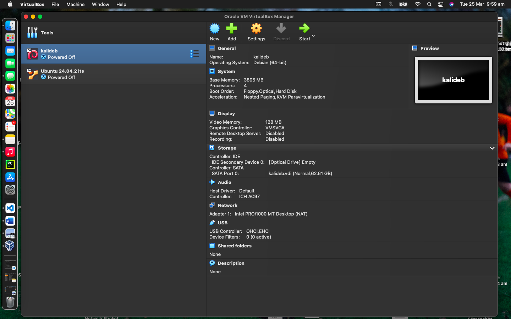
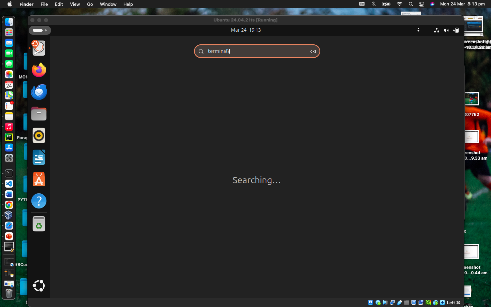

# DevOps Lab Environment Setup

This project demonstrates the setup of my DevOps lab environment, highlighting the essential tools and configurations used.

## Development Environment: VS Code

VS Code serves as my primary Integrated Development Environment (IDE) throughout this project.

## Version Control: Git

Git is installed and configured for version control. The following screenshot shows the installed Git version:

## Virtualization: VirtualBox

VirtualBox is used for running virtual machines, specifically Kali Linux and Ubuntu. While both are installed, I primarily use Kali Linux due to my familiarity and comfort with it.

## Ubuntu Virtual Machine

The following screenshot shows the Ubuntu virtual machine running within VirtualBox.

## Code Repository: GitHub

GitHub is used for documenting project progress and collaborating with other engineers.

## Cloud Platform: AWS

An AWS account is utilized for cloud-based exercises and deployments.

